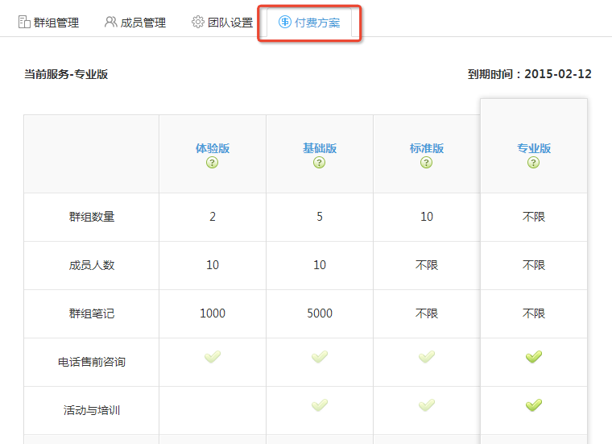
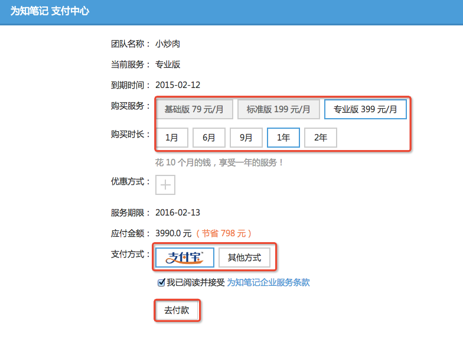

## 为知笔记企业服务
为知笔记企业服务，为中小团队提供了互联网时代的资料共享解决方案，团队可利用为知笔记企业群组，搭建内部资料库，共享工作记录，在团队内部进行协作沟通。
####什么是企业群组
为知笔记的群组服务，是存储空间的一种形态，在群组中，可以共享笔记、附件、文档。用户按照不同的权限查看或管理群组内容，还能够对笔记进行评论和回复
####如何利用企业群组
 * 群组目录，打造井井有条的资料库
 * 评论与消息，提高团队协作效率
 * 团队经验积累

## 开通企业服务
1.登录为知笔记Mac客户端，点击左侧的“团队&群组 +”

1. 在弹出的页面中，选择“开通企业服务“

 * 若当前账号已经创建过团队，这里会显示”创建企业群组“
 * 开通后，当前账号将作为团队创建者账户，即超级账户

1. 进入开通向导
 * 第一步，完善团队基本信息

 * 第二步，根据需求，选择所要创建的企业群组

  > 默认可选择2个，选择后可在客户端中进行修改
  > 如需增加企业群组，可在创建成功后升级服务；

 * 第三步，输入成员邮箱，添加到团队，这里会将成员默认分配到所有群组

  > 开通成功后，会发送一封确认邮件，成员点击正文中的链接操作即可
1. 完成向导后，自动进入团队管理后台，如无需继续添加成员，可将窗口关闭

1. 点击Mac客户端的同步按钮，查看新创建的群组和目录

##升级企业服务
为知笔记企业服务为不同类型、规模的团队，结合提供了多种产品套餐方案。
### 公有云方案

点此了解：http://blog.wiz.cn/wiznote-biz-pricing.html

### 公有云购买

1. 开通试用后，登录为知笔记企业服务网页版（https://note.wiz.cn ），访问管理后台”服务资费“标签页，在产品套餐表格中，选择相应的方案进行支付。

1. 在支付中心，选择所要购买的服务类型与时长，选择支付类型进行购买

 * 如采用汇款或转账方式，请选择”其他方式“，在弹出框中查看汇款或转账的相关信息，点击”去付款”后，系统会记录您的订单号，客服人员在接到您的汇款或转账凭证后，会联系您为您升级

### 私有部署方案

为知笔记企业服务提供私有部署方案，您可以选择将服务端部署在公司内部的服务器，自主维护和管理，详询 400-825-8085
