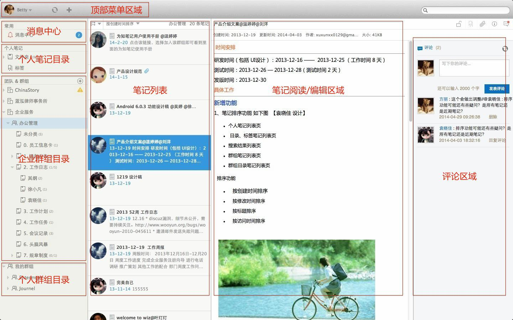

# 主界面介绍

1. #### 消息中心
    用于显示接受和发送的笔记消息，包括评论、回复、编辑等
1. #### 个人笔记目录
    显示个人笔记目录与标签
1. #### 企业群组目录
    显示团队列表、群组以及目录
1. #### 笔记列表
    显示所选目录下的笔记，可多行或单行显示
1. #### 笔记阅读/编辑区域
    显示选择或编辑的笔记
1. #### 评论区域
    发布或回复评论，显示评论列表，需点击评论按钮展开
1. #### 顶部菜单
    显示头像、同步按钮和新建笔记按钮

#### 注：为知笔记提供Linux客户端，功能与界面同Mac相仿，可参考此手册
除Ubuntu系统之外，需自行编译安装，[详情点击](http://blog.wiz.cn/wiznote-linux.html)
