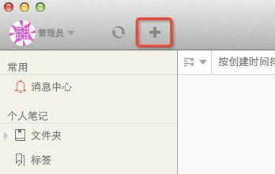
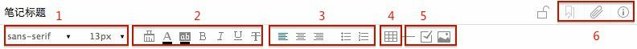
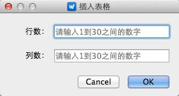
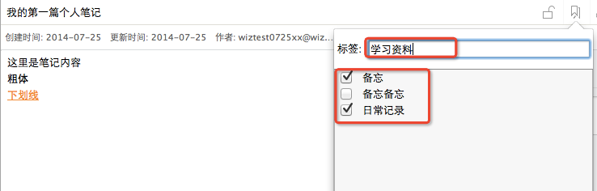
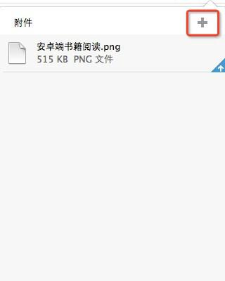
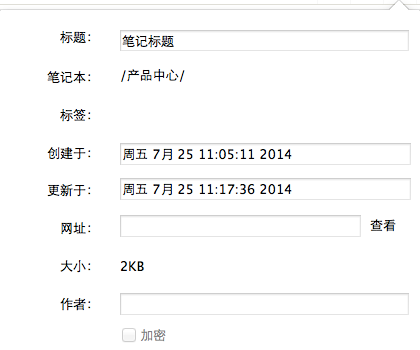
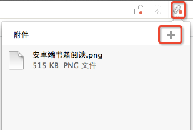

##新建笔记

点击顶部的新建笔记按钮即可新建空白笔记

 

##编辑笔记
#### Mac客户端内置编辑器说明

 

1. 字体与字号
2. 格式控制
 * 格式刷，将选中文字统一修改格式
 * 文字颜色
 * 文字背景色
 * 粗体
 * 斜体
 * 下划线
 * 删除线
    通过删除线、文字背景高亮，可在协同编辑中，对文字进行标识

3. 对齐与列表
 * 左对齐、居中对齐、右对齐
 * 无序列表、有序列表
4. 表格工具
 输入行列，可添加表格

5. 添加间隔线、待办清单、图片
6. 笔记相关信息

 * 添加标签

    点击笔记右上角的标签按钮，可添加或查看笔记标签

    
    在输入框中，输入文字，点击回车，添加新标签，还可勾选已有标签

    群组笔记不支持标签
 * 添加附件

    查看笔记附件，点击”+“进行添加

    
 * 查看笔记属性

    

####文本录入

在编辑框中，直接输入文本，可修改字体、字号、文字颜色，调整格式，对其方式，添加有序列表与无序列表等，具体参照 内置编辑器说明

#### 添加附件

点击添加附件按钮，在弹出框中点击 + ，选择上传的附件内容

附件上传状态：右下角有蓝色箭头的，表明还未上传至服务器，如无任何标记，说明已经上传成功

#### 图片录入

点击添加图片按钮，浏览至所要添加的图片；也可在编辑模式下直接粘贴剪贴板中的图片

##删除笔记
右键点击群组列表中的笔记，选择“删除”
