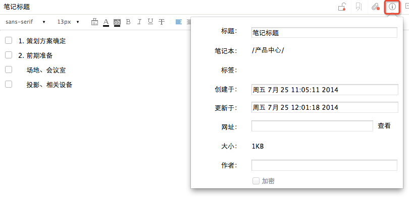
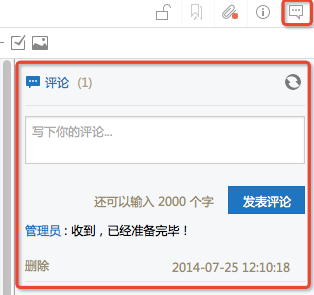

##阅读笔记
#### 阅读笔记信息

点击笔记，选择右上角的笔记信息按钮，可查看笔记相关属性

 * 笔记本：笔记所在目录

 * 标签：笔记添加的标签

 * 创建时间与更新时间

 * 网址：若当前笔记为使用网页剪辑器保存，此处显示原网址，可点击”查看“在浏览器中打开

 * 大小与作者

 * 若当前笔记在其他客户端被加密，加密前的复选框为选中状态

#### 评论

点击笔记右上角的评论按钮，可打开评论区域

#### 标签

左侧常用区域中，点击标签分类，可查看标签下的笔记

#### 微信收藏

通过微信收藏的笔记，默认保存在个人笔记--微信收藏目录中。了解详情点击:[如何保存微信内容到为知笔记？](http://blog.wiz.cn/wiz-wechat.html)

#### 微博收藏

通过@保存到为知笔记 收藏的微博，默认保存在个人笔记--微博收藏 目录中

#### 我的邮件

通过mywiz邮箱手机的笔记，默认保存在个人笔记--我的邮件目录。更多有关mywiz邮箱请点击：[mywiz邮箱使用方法](http://blog.wiz.cn/wiz-mywiz.html)

