##团队管理及应用目录
+ 团队应用带来的价值
+ 团队管理（群组管理；成员管理；团队设置）
+ 团队角色权限说明
+ 资料管理和共享
+ 团队协作（团队沟通；协同编辑；简单的任务分配）

##团队应用带来的价值
####汇集团队经验智慧并传承下去--知识库、经验库
为知笔记帮助团队中的成员简单方便地把自己的知识经验记录下来并分享到企业群组中。来自不同成员的知识逐步积累成一个团队知识库，在目录层级管理和强大搜索功能帮助下，团队成员可以随时随地找到自己需要的知识。
####随时随地进行沟通和协作
为知笔记让团队形成一个“工作圈”，通过成员间的消息通知、笔记评论等功能，可以快速实现内部沟通交流。在多种笔记终端，尤其是手机终端的支持下，每个团队成员，无论何时何地都可以跟团队保持着工作上的紧密联系。
####管理变得更加高效和人性化
在为知笔记中，管理者可以通过各种终端随时随地浏览下属的工作笔记，了解他们的工作进展，并通过评论功能进行管理反馈。团队成员使用为知笔记创建各种类型的工作笔记，只需通过一个简单的@功能，就可以提交给上级领导，无需再依靠email和office，团队中的工作管理变得简单和高效。

##  创建团队

1. 点击“团队&群组 +”

    

1. 在弹出窗口中，选择”开通企业服务“

    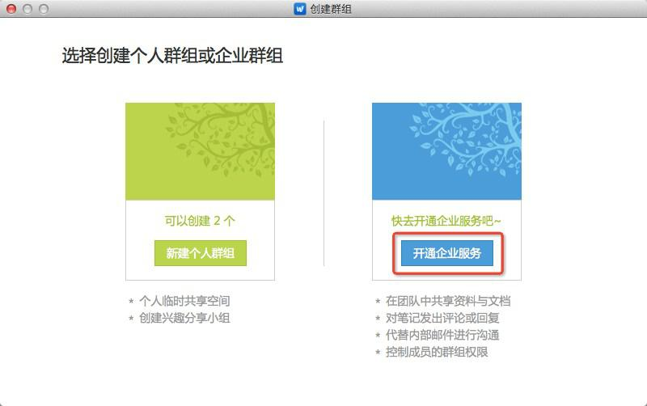
 * 开通后，该账号将作为管理员账户
 * 若当前已经开通企业服务，按钮上会显示”创建企业群组“
1. 在弹出的页面中，完成企业服务开通向导
 * 第一步，完善团队基本信息

    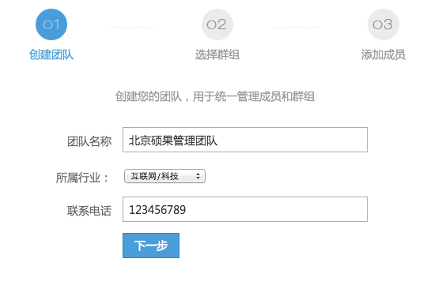
 * 第二步，根据需求，选择所要创建的企业群组

    
  > 默认可选择2个，选择后可在客户端中进行修改
  > 如需增加企业群组，可在创建成功后升级服务；

 * 第三步，输入成员邮箱，添加到团队，这里会将成员默认分配到所有群组

    
  > 开通成功后，会发送一封确认邮件，成员点击正文中的链接操作即可

1. 完成向导后，自动进入团队管理后台

    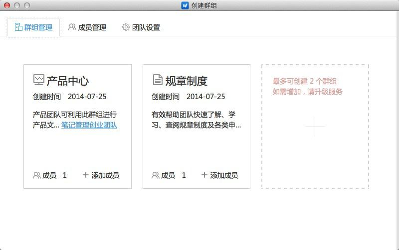

##  后台管理

在团队管理后台，可管理群组，包括为群组添加、删除成员；修改群组名称、备注等；还能够集中管理团队成员，设置团队成员角色等
1. 右键点击团队名称，选择”管理团队“，即可进入管理页面

    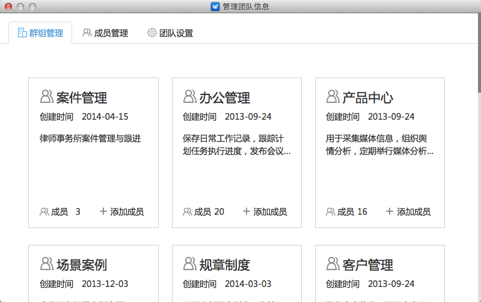
1. 新建群组
点击“+”新建群组，可在根据行业推荐的群组中选择，也可输入群组名称进行自定义

    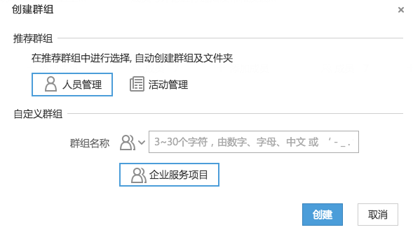
 * 自定义群组可修改群组图标

#### 群组管理
1. 进入团队管理后台，选择“群组管理”页签
1. 群组卡片列表中，点击群组名称或备注，可进行修改

    
1. 点击“成员”，可查看当前群组所有成员，并修改成员权限

    
 * 可点击复选框，多选进行“删除”或“更改权限”操作
 * 点击“添加成员”，可为当前群组添加成员
1. 点击群组卡片上的“添加成员”，在弹出窗口中，选择其他团队成员，分配到当前群组

    
 * 头像上显示的，是不在当前群组中的成员
 * 团队创建者或团队管理员，可在这里添加新的团队成员，并将其加入到群组
 * 点击“添加为”可选择相应权限
 * 团队成员角色与管理权限的区别，参见 10.2.2.3 权限说明

#### 成员管理
在成员管理模块，可添加、删除团队成员，设置成员角色，将成员分配到群组等
1. 添加成员
输入成员邮箱或手机号，点击“添加到团队”，可将成员加入到团队中。

    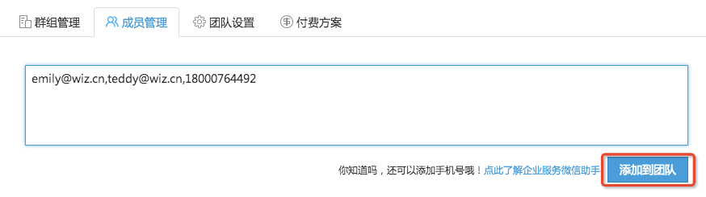
 * 被添加的邮箱，将会收到一封确认邮件，未注册为知笔记账号的用户，根据其中的链接操作即可
 * 添加手机号，系统会自动将手机号创建为为知笔记账号，还可使用企业服务微信助手功能，详情可点击按钮左侧的链接
 * 输入不符合格式要求的邮箱或手机号，无法添加，但会保留在文本框中以方便修改
1. 修改昵称
添加完成员后，可在下方的列表中修改昵称
将鼠标移动到头像上，点击昵称，出现文本框，输入新的团队昵称即可

    
 * 为了统一管理成员姓名，避免出现过于个性化、不可识别的昵称，成员不可自行修改昵称
 * 个人账户设置中的昵称，仅显示在个人笔记功能中
1. 设置成员角色
 点击成员头像，在页面下方弹出的操作栏中，可设置成员角色

    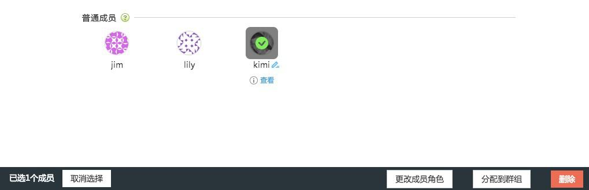
 * 成员角色，用于区分改成员是否具有团队管理权限，即是否能够添加新团队成员，是否可以管理群组等，具体参照10.2.2.3 权限说明
1. 分配到群组
 点击头像，在页面下方弹出的操作栏中，可将成员分配到群组

    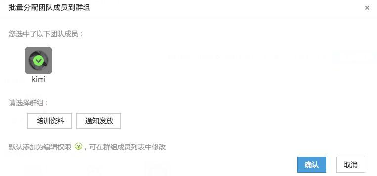
 * 可多选头像，添加到群组
 * 成员默认被添加为编辑权限，可在群组成员列表中进行修改
1. 成员查看
 鼠标移动至头像上，点击”查看“按钮，可查看成员已经加入的群组

    
 * 点击”移出群组“，可快速将成员从群组中删除
 * 点击”权限“，可设置成员的群组权限

#### 团队设置
在团队设置中，可修改团队名称、简介和电话

#### 付费方案
付费方案展示了企业服务各个等级的对比与价格，可点击”购买“进入支付中心购买或续费企业服务

 * 群组笔记：每个群组可新建的笔记数，体验版或基础版笔记数达到上限，可删除历史笔记以便继续新建
 * 体验版到期，或服务到期后，无法进行后台管理，已有数据可以下载使用

##权限说明

**1.团队成员角色**

成员角色，是指该用户在团队中的管理角色分两种：
+ 团队管理员
+ 普通成员

**创建者：**仅有一人，是团队最高管理者，角色不可改，具有最高权限

**2.成员权限是针对群组界定的**

包括：
+ 群组管理员
+ 超级用户
+ 编辑
+ 作者
+ 读者

**更多详细说明请点击：**[企业服务 团队成员角色与群组权限对比说明](http://blog.wiz.cn/team-role-auth.html)

##资料管理与共享

####使用企业群组，搭建内部资料库

创建群组、目录，用于保存团队内部共享的资料、文档
添加团队或群组成员，在群组中添加资料、创建笔记，进行共享和查看
操作方法

**1.在已有群组中创建目录**

右键点击群组名称，点击“新建文件夹”
右键点击目录名称，点击“重命名文件夹”或“删除文件夹”，可维护群组下的目录

**2.创建群组**

点击“团队&群组 +”，选择“创建企业群组”
在弹出窗口中，填写群组信息
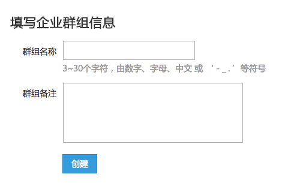

**3.创建笔记、添加附件等**（可通过Windows客户端拖动本地office文档上传 ）

+ 新建笔记
+ 添加附件

**4.添加群组成员，进行共享**

点击banner上的按钮，选择想要设置的群组
点击添加成员，可选择当前不在群组中的团队成员
如果你的角色是团队管理员或团队创建者，可在这里直接添加新的团队成员到群组中

##团队协作

利用企业群组，在团队私有的存储空间中可进行笔记、资料和附件的共享。在群组中，成员可针对笔记或资料进行沟通，如要求某人查阅资料；对内容提出修改或改进意见等，并能够以消息的形式提醒成员。

####标题@提及人员

在笔记标题中输入“@”，在弹出的成员列表中，选择要提及的人员，完成后保存笔记，笔记上传成功后，被提及的人，会在消息中心接收到提醒
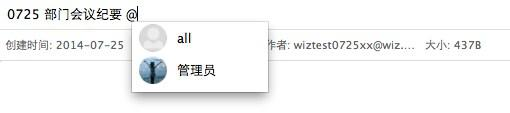
* 列表中为当前群组成员;
* 支持拼音匹配；
* 若要提及群组中所有人，可输入“@all";

#### 对笔记发表评论
点击笔记右上角的评论按钮，在评论区域文本框中输入评论
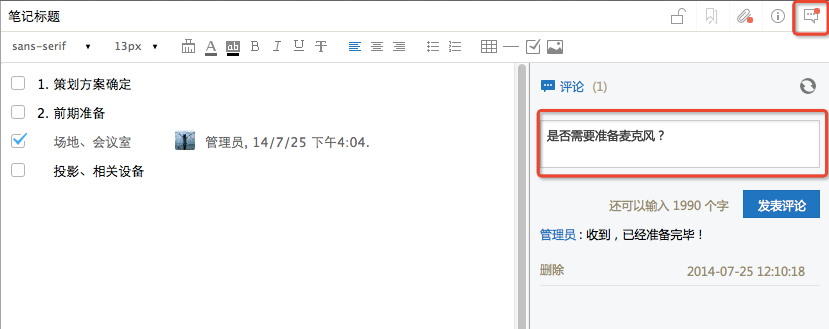
点击”发表评论“，笔记作者会在消息中心收到笔记被评论的提醒；
 * 评论中，可@提及成员，被提及的人，同样会接收到消息；
 * 笔记阅读状态下，评论按钮上有红点，即表示该篇笔记有评论。

####消息中心

消息中心是用来接收标题@、评论、评论回复消息的统一入口
点击左侧”消息中心“按钮：
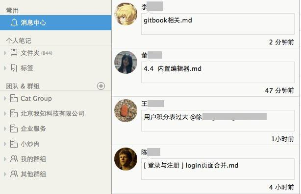

1. 可查看未读消息
在消息列表中，背景为蓝色的消息，即为未读消息；

2. 按类型查看消息

消息分为如下几种分类：
* 提到我的：在笔记标题中@提及我的、或在评论中@提及我时接收的消息
* 评论我的：我的笔记被评论时接收的消息
* 回复我的：回复我的评论时接收的消息
* 修改我的：我的笔记被编辑时接收的消息

点击消息，可查看相关笔记；

####协同编辑
为知笔记可以提供多人编辑一篇笔记，来提高团队工作效率。但是，这里需要注意当一个成员在编辑的时候，另外的客户端会出现**成员正在编辑笔记，此时不要进行编辑。待该成员保存成功后再编辑。
####简单的任务分配
如果作为领导的你这在外出，但是需要做一些简单的任务分配给员工，可以通过任务清单功能，分配一下任务
