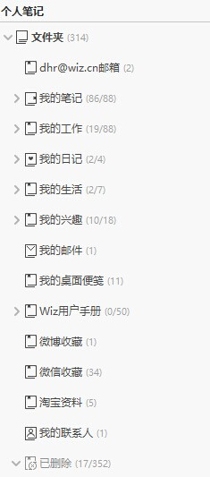
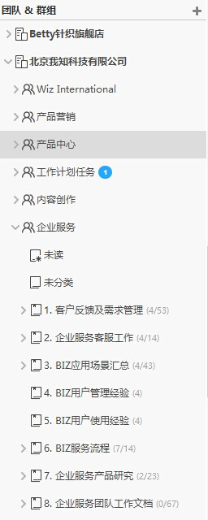
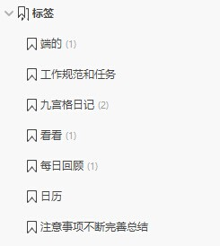

##管理笔记目录
为知笔记支持无限多级目录，利用此特性，可灵活搭建资料目录，管理笔记
#### 按目录管理笔记

 * 选择个人笔记，展开目录，可按照目录浏览个人笔记
 * 选择企业群组，展开目录，可浏览群组笔记

#### 新建目录
选择个人笔记或群组，点击右键，选择”新建文件夹“
输入目录名称，点击”OK“

#### 重命名目录
右键点击目录名，选择”重命名“，在弹出窗口中输入新的目录名称

#### 删除目录
右键点击目录名，选择”删除“

#### 拖动目录
通过鼠标拖动的方式，可将目录及目录下的笔记，复制

##管理笔记标签

#### 为笔记添加标签
点击笔记右上角的标签按钮，可添加或查看笔记标签

   在输入框中，输入文字，点击回车，添加新标签，还可勾选已有标签
> 群组笔记不支持标签

#### 按标签阅读笔记
左侧常用区域中，点击标签分类，可查看标签下的笔记

### 新建标签
1. 在标签区域点击右键，选择”新建标签“，输入标签名称，点击OK

### 删除标签
1. 右键点击标签，可选择”重命名“或”删除“标签

