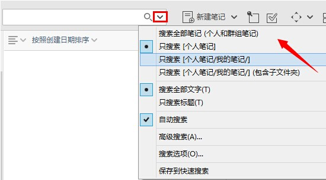

##快速搜索笔记
为知笔记提供了强大的搜索功能，在搜索框键入关键字即可搜索，打开文档能够自动跳转并高亮关键字。点击三角按钮，还可以打开更多搜索设置

####搜索关键词
在搜索栏中可以输入多个关键字a和b，
用空格隔开，默认是and 关系,即列举的多个关键词在文章中都有时，笔记才能被找到。
关键词之间用or连接，就可以搜索到含a或含b的笔记。

####快速搜索
快速搜索帮我们更快找到笔记，主要有以下几种方式
- 通过属性搜索，可以筛选出无标签的笔记、包含附件的笔记和各个有评价的笔记。
- 通过时间搜索，创建日期、修改日期、访问日期都可以作为搜索的标准。
- 已保存的搜索是指可以对某些比较常用的关键词建立快捷搜索

####快捷方式
为知笔记提供了快捷方式，可以把自己经常要查看或者修改的笔记拖拽到快捷方式区域，就可以快速定位了。

####搜索范围
搜索时根据目前左栏目录树中选中的是什么，搜索菜单中提供四个搜索范围，供我们选择：
- 全部笔记，包含个人笔记和群组笔记
- 个人笔记或某群组笔记
- 某文件夹下的根部笔记
- 某文件夹下的所有笔记（包含子文件下的笔记）

另外下面还可选取是搜索全部文字还是搜索标题

####高级搜索
在高级搜索中可以进行更多搜索方面的细节设置，还可以筛选出有相同标题或来源的重复笔记。

####搜索选项
为知笔记windows客户端的搜索利用全文索引来搜索笔记。每隔一段时间为知笔记就会在后台更新索引，在搜索前若有笔记还未更新到索引，也会马上进行这部分笔记的索引更新，防止这部分笔记无法被准确搜到。搜索选项主要帮助用户自行更新或重建索引。
注意：若需要让加密笔记也被搜索到，需要到搜索选项处填写证书密码，用于建立加密笔记的全文检索索引。

