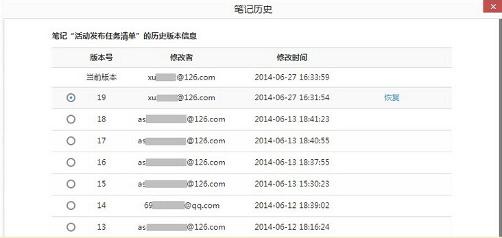

## 为知技巧目录
点击目录的链接即可跳转到相应的位置。为了给用户更详细的说明，大部分内容采用链接到为知笔记博客上，其中的一部分在本页内说明。本部分内容在持续更新中……

#### 特别推荐
+ [如何用 markdown 写出格式良好的笔记？](http://blog.wiz.cn/feature-markdown.html)
+ [自定义笔记模板](http://blog.wiz.cn/faq-templates.html)
+ [为知笔记桌面便签、任务列表、日历](http://blog.wiz.cn/wizsticker.html)
+ [语音快速转文字](http://blog.wiz.cn/android-6-0-9.html)
+ [离线阅读功能](http://blog.wiz.cn/offline.html)
+ <a href="#history">历史版本恢复功能</a>

##为知笔记使用技巧

#### <a name="history">历史版本恢复功能</a>

在长时间的笔记使用过程中，如果发生多人修改笔记的冲突的情况，不用着急，为知笔记windows客户端提供了历史版本恢复功能。

**笔记历史版本恢复：**
+ 点击笔记标题上方的“笔记历史”按钮

    

+ 选择需要恢复的版本->点击恢复即可

    

**附件历史版本恢复：**
+ 右键点击附件->历史

    

+ 选择需要恢复的版本->点击恢复即可

    

历史版本是指服务器会自动保存每篇笔记的近20个版本。如果一篇笔记做了修改，并同步成功，即产生了新版本，修改前的作为历史版本保留在服务器中，可恢复找回。

注意：
- 如果在不联网不同步的情况下一直在做修改，无法保存在历史版本中，因为没有同步的话服务器就无法记录。
- 历史版本恢复最对只支持保存最近的20个版本
