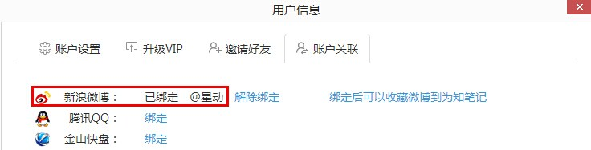

## 网页剪接器收集
为知笔记的前身是网文快捕，所以为知笔记继承了网文快捕的很多快速抓取网页内容并保存到为知笔记的功能。支持用多种浏览器的网页剪辑器插件，快速的保存网页内容。网页保存方式包括保存整页、保存正文、保存选择、保存到本地等。

了解如何使用网页剪接器快速保存网页，请点击[<如何使用为知笔记快速抓取网页内容？>](http://blog.wiz.cn/webclipping.html)

## mywiz邮箱导入
为知笔记的个人用户和企业群组成员都有对应的 mywiz 邮箱，通过将邮件发送到为知笔记 mywiz 邮箱，可快速将邮件（邮件正文中的图片及附件）或网页收集到为知笔记中
+ 发送到个人 mywiz 邮箱的内容，保存在“我的笔记或我的邮件”目录下
+ 发送到群组 mywiz 邮箱的内容，保存在“群组–群组邮件”目录下

#### mywiz 邮箱在哪里查看？

+ **个人 mywiz 邮箱：**点击头像，选择“账户设置”， 可查看你的个人 mywiz 邮箱，你也可以在为知笔记 iPhone 版的设置里开启“分享网页到为知笔记”的选项，这样你的 mywiz 邮箱就会自动保存到通讯录里了。
+ ** 群组 mywiz 邮箱：**每个群组下的每个成员都有对应的 mywiz 邮箱，发邮件给这个邮箱，共享内容到群组。到每个群组的群组属性下查看你的各个群组的 mywiz 邮箱，你可以直接复制，也可以直接添加到联系人哦。

更多有关mywiz邮箱请点击：[mywiz邮箱使用方法](http://blog.wiz.cn/wiz-mywiz.html)

## 微博导入
当你在微博上看到感兴趣、有价值的文字图片时，直接评论或转发给@保存到为知笔记，就保存到为知笔记中了，同步完成后还能够离线阅读. 需要注意的是，在使用前需要先在为知笔记中绑定微博帐号。

绑定微博账号：
+ 点击头像->选择账户设置
+ 点击账号关联->绑定微博账号即可

    

##微信导入
在微信里经常看到有价值的信息，如果你想把它保存到为知笔记，方便后边随时查看永久保存。为知笔记支持强大而简捷的微信文章保存到为知笔记的功能。

了解详情点击:[如何保存微信内容到为知笔记？](http://blog.wiz.cn/wiz-wechat.html)
