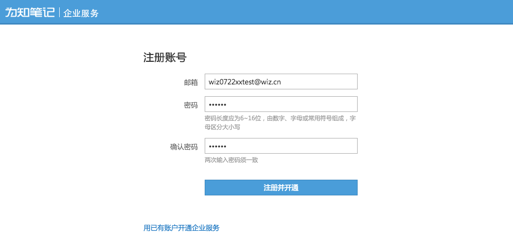
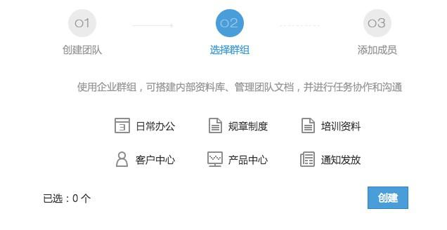
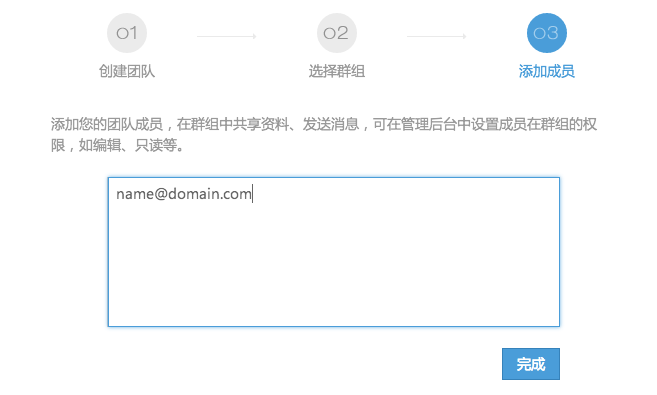
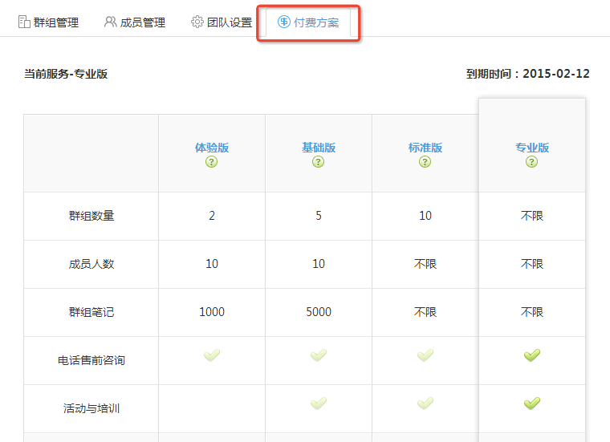

## 为知笔记企业服务
为知笔记企业服务，为中小团队提供了互联网时代的资料共享解决方案，团队可利用为知笔记企业群组，搭建内部资料库，共享工作记录，在团队内部进行协作沟通。

#### 什么是企业群组
为知笔记的群组服务，是存储空间的一种形态，在群组中，可以共享笔记、附件、文档。用户按照不同的权限查看或管理群组内容，还能够对笔记进行评论和回复

#### 如何利用企业群组
* 群组目录，打造井井有条的资料库
* 评论与消息，提高团队协作效率
* 团队经验积累

## 开通企业服务

为知笔记的各个客户端都支持团队、群组的创建和管理，随时随地都可以方便的完成团队资料共享和团队协作

1. 访问 http://www.wiz.cn/biz ，输入您的常用邮箱，点击”免费开通企业服务“

    

    + 如果已经有为知笔记账号，建议使用您的账号邮箱开通企业服务；
    + 如果您是新用户，建议使用您的企业邮箱进行开通
    + 开通后，该账号讲作为管理员账户

1. 在弹出的页面中，完成企业服务开通向导

    * 第一步，完善团队基本信息

    
    * 第二步，根据需求，选择所要创建的企业群组，将鼠标移到群组名称上方，可查看该群组的建议用途、内置的目录等信息

    
    > 默认可选择2个
    > 如需增加企业群组，可在创建成功后升级服务；
    * 第三步，输入成员邮箱，添加到团队，这里会将成员默认分配到所有群组

    
    > 开通成功后，会发送一封确认邮件，成员点击正文中的链接操作即可

1. 完成向导后，自动进入团队管理后台

## 升级企业服务

为知笔记企业服务为不同类型、规模的团队，结合提供了多种产品套餐方案。

**如何升级企业服务？**

[点此了解，为知笔记公有云付费方案](http://blog.wiz.cn/wiznote-biz-pricing.html)

1. 开通试用后，[登录为知笔记企业服务网页版](https://note.wiz.cn )

1. 点击头像->选择管理后台，访问管理后台”付费方案“标签页

    

1. 在产品套餐表格中，选择相应的方案进行支付。

    

1. 也可以登录Windows版客户端，右键点击团队名称，选择”管理团队“，在弹出窗口中，查看”付费方案“标签，选择支付。

**注：**为知笔记企业服务提供私有部署方案，您可以选择将服务端部署在公司内部的服务器，自主维护和管理，详询 400-825-8085
