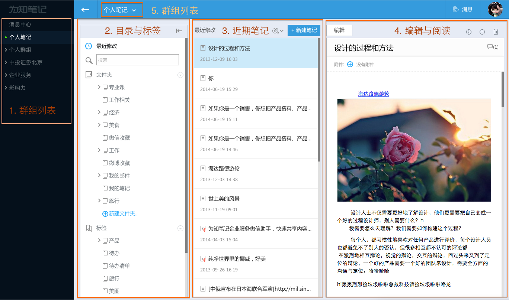

# 主界面介绍
## 为知笔记网页版
网页版采用了分栏的布局模式，轻量级Web页面，完全能满足工作和生活记录、收集、协作的需求：

1. **群组列表**

    可在此区域选择个人笔记、个人群组和企业群组
    点击顶部banner的箭头，可将此区域折叠

1. **目录与标签**

    显示个人笔记或群组下的目录结构以及标签
    可点击 ，将该区域折叠

1. **近期笔记**

    显示某目录下的近期笔记，默认按笔记创建时间排列
    可修改排序规则

1. **阅读与编辑**

    点击某篇笔记，在此区域编辑或阅读笔记
