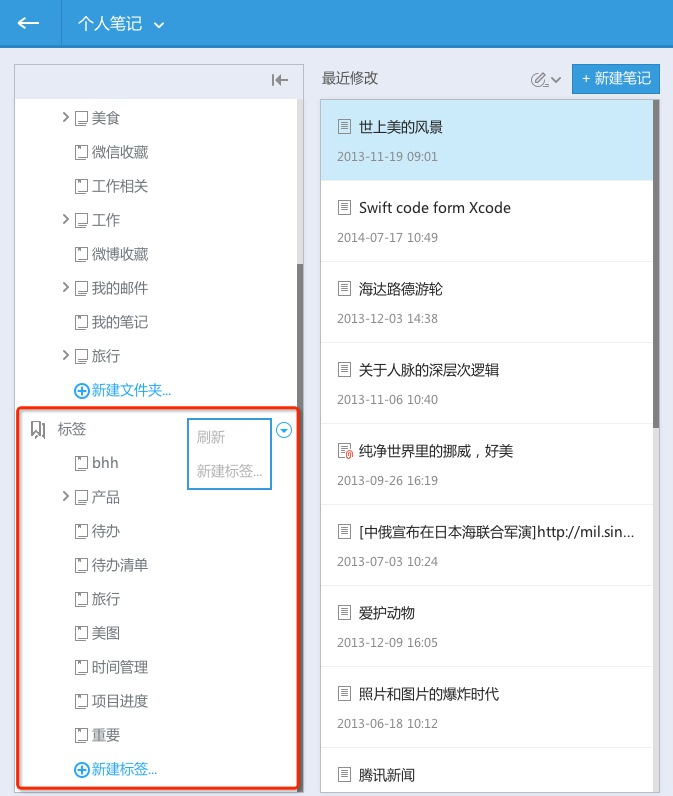

## 管理笔记
#### 目录

1. 点击”←“，再展开的群组目录中，选择个人笔记或群组
1. 在第二栏中，点击文件夹右侧的下拉图标，在弹出窗口中选择菜单进行操作：新建子文件夹，重命名，或删除
1. 点击“新建文件夹”新建目录

#### 标签
通过标签查看笔记

登录网页版，选择所要查看的群组，在“目录与标签”区域，可查看所有标签
点击标签，可阅读添加了该标签的笔记

#### 历史版本恢复

为知笔记保存笔记历史版本，可根据修改时间选择历史版本进行恢复

1. 打开需要恢复的笔记，点击右上角的“历史版本图标”
1. 在弹出窗口中，选择索要恢复的历史版本
1. 刷新网页，即可查看恢复后的笔记
> 免费用户 可恢复最近1次历史版本，VIP用户，可恢复最近20次历史版本。更多详情：[享受为知笔记VIP服务](http://blog.wiz.cn/wiz-vip.html)
