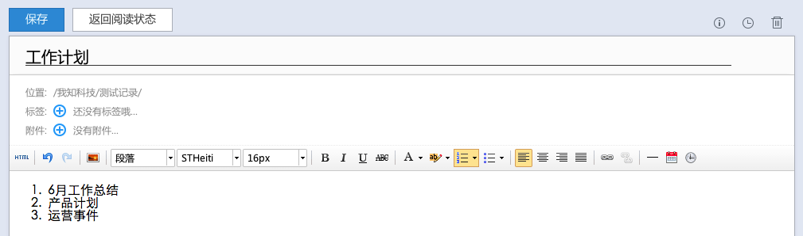
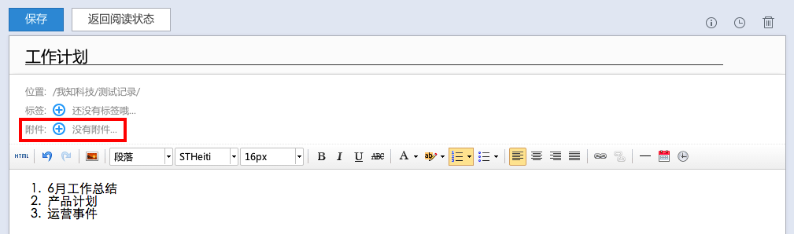
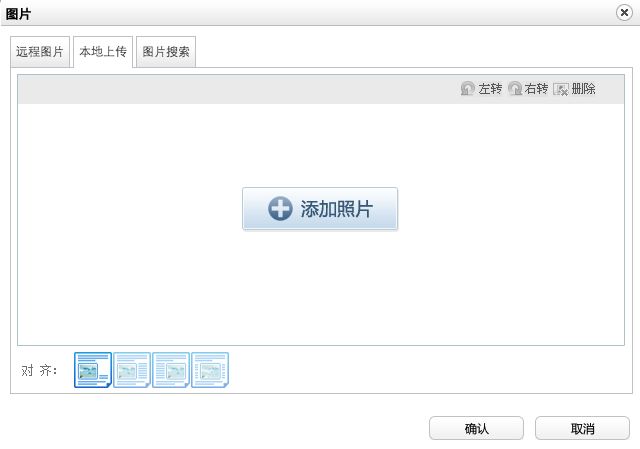

## 新建笔记
#### 文本录入

访问网页版为知笔记，选择相应的目录后，点击“新建笔记”即可进行文本录入。网页版不支持模板笔记、任务列表等笔记录入，暂时只能查看，如需录入这些版本可下载使用Windows客户端录入。
## 编辑笔记
#### 支持多文本样式
在编辑区域中输入文本，完成后点击“保存“，如需退出编辑状态，点击”返回阅读状态“
网页版调用的编辑器是UEditor，是基于HTML的富文本所见即所得编辑器，能够支持多种文本样式：

    * 样式、字体、字号
    * 有序列表
    * 无序列表
    * 超链接
    * 表格

#### 添加附件

点击附件+，将文件拖动到弹出窗口区域中，进行附件上传
> 文件大小不超过5M
> 为便于存储，上传的附件默认会打包成为zip格式供下载

#### 图片录入

1. 正文插入图片
    在编辑器中，点击”“，在弹出窗口中，选择图片上传

    
    * 可选择图文混排模式，并能够能够通过链接添加远程图片

1. 上传图片附件
    您也可以将图片作为附件上传，直接点击添加附件即可。
