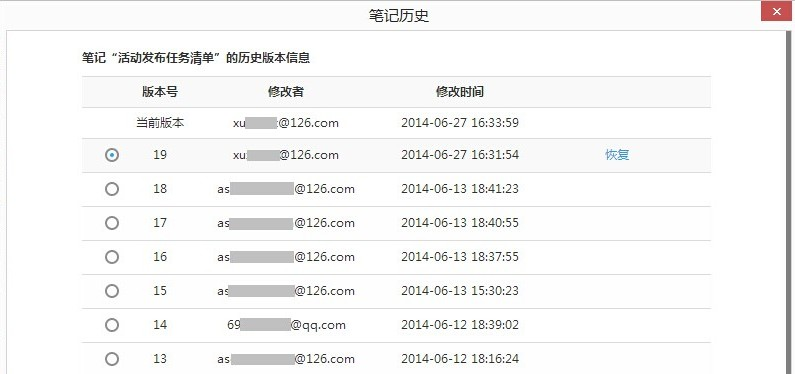
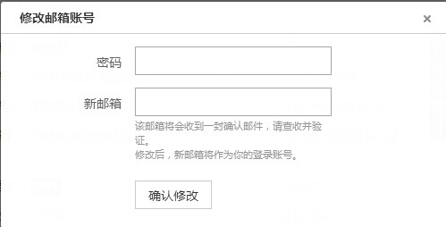

## 为知技巧目录
点击目录的链接即可跳转到相应的位置。为了给用户更详细的说明，大部分内容采用链接到为知笔记博客上，其中的一部分在本页内说明。本部分内容在持续更新中……

#### 为知笔记企业助手

+ [为知笔记企业助手，打开微信看笔记](http://blog.wiz.cn/weixin-admin-help.html)
+ [企业服务微信助手，快速查阅群组笔记和消息](http://blog.wiz.cn/weixin-wiz-user.html)
+ [为知笔记企业服务微信助手，快速共享内容给他人](http://blog.wiz.cn/weixin-help.html)

#### 特别推荐
+ [如何用 markdown 写出格式良好的笔记？](http://blog.wiz.cn/feature-markdown.html)
+ [自定义笔记模板](http://blog.wiz.cn/faq-templates.html)
+ [为知笔记桌面便签、任务列表、日历](http://blog.wiz.cn/wizsticker.html)
+ [mywiz邮箱使用方法](http://blog.wiz.cn/wiz-mywiz.html)
+ [语音快速转文字](http://blog.wiz.cn/android-6-0-9.html)
+ [离线阅读功能](http://blog.wiz.cn/offline.html)
+ <a href="#WebTipsVersion">历史版本恢复功能</a>

#### 基本使用技巧
+ <a href="#WebTipsLink">复制笔记链接发送给群组成员查看</a>
+ <a href="#WebTipsEmail">更换登陆邮箱账号</a>

## 为知笔记使用技巧
#### <a name="WebTipsVersion">历史版本恢复功能</a>

在长时间的笔记使用过程中，如果发生多人修改笔记的冲突的情况，不用着急，为知笔记windows客户端提供了历史版本恢复功能。

**笔记历史版本恢复：**
+ 点击笔记标题上方的“笔记历史”按钮

    
+ 选择需要恢复的版本->点击恢复即可

    
+ 选定某一版本，点击“对比”，可与当前版本进行文字比对，其中，绿色表示在历史版本上新增的内容，红色表示在历史版本上删除的内容

	

**附件历史版本恢复：**
+ 右键点击附件->历史

    
+ 选择需要恢复的版本->点击恢复即可

    

历史版本是指服务器会自动保存每篇笔记的近20个版本。如果一篇笔记做了修改，并同步成功，即产生了新版本，修改前的作为历史版本保留在服务器中，可恢复找回。

注意：
- 如果在不联网不同步的情况下一直在做修改，无法保存在历史版本中，因为没有同步的话服务器就无法记录。
- 历史版本恢复最对只支持保存最近的20个版本
- 免费用户可恢复到最近的一个版本，升级企业版或者个人VIP可获得更多历史版本恢复。有关个人VIP更多详情：[享受为知笔记VIP服务](http://blog.wiz.cn/wiz-vip.html)

#### <a name="WebTipsEmail">更改登录邮箱</a>
为知笔记支持更换登录邮箱ID，可以给企业用户因为离职人员或者个人用户因邮箱问题难以找回密码带来的麻烦。
+ 点击头像左侧的下拉按钮->账号设置

    
+ 账户设置页面中修改邮箱，重新输入一个未曾注册过我知笔记账号的邮箱并输入密码即可更改

    
+ 更改后推出为知笔记，重新用新的邮箱登陆即可

    

#### <a name="WebTipsLink">网页版复制笔记链接发送给群组成员</a>
使用网页版阅读笔记时，可将浏览器中的链接复制发送给群组成员，点击后登录即可阅读笔记
