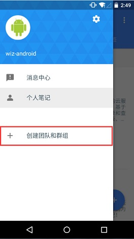
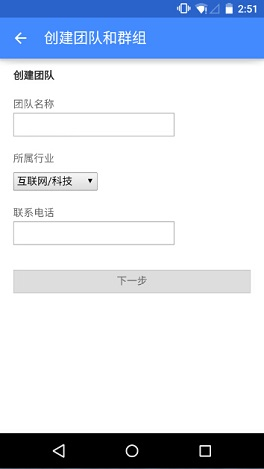

## 开通企业服务
为知笔记的各个客户端都支持团队、群组的创建和管理，随时随地都可以方便的完成团队资料共享和团队协作。
#### 创建团队

如果你还不是为知笔记用户，首先你要 成为个人笔记用户，接着按如下步骤完成团队的创建 
1.登录账号进入为知笔记 
2.从左边缘向右滑到左侧边栏 
3.点击“创建团队和群组” 
    
4.按照向导输入对应的信息，最后点击“结束向导”完成团队创建 
    

    
此刻你就是为知笔记企业服务体验版用户了，为知笔记企业服务体验版，可以享受以下功能
+ 可以创建两个群组
+ 可添加 10 个团队成员
+ 可免费体验 1 个月

注：在手机端给团队添加成员，不仅是团队成员，默认也分配到了各个群组。

##升级企业服务
####企业服务付费方案

为知笔记企业服务目前提供三种付费方案：基础版（适合 10 人以下的团队）、标准版（适合 20 人以下的团队）、专业版（团队人数不限）。三种付费方案的功能对比请点击:[为知笔记企业租用服务资费](http://blog.wiz.cn/wiznote-biz-pricing.html) 
####手机端如何购买企业服务

1.登录帐号进入为知笔记
1.从左边缘向右滑到左侧边栏
1.点击企业名称右侧的“管理团队”图标，进入团队管理页面
1.点击团队设置，选择底端的“付费方案”
1.选择适合您团队的付费方案，执行购买操作
1.在购买的页面，如果您需要开发票或者要使用优惠劵，在购买页面要注意哦

用户可以通过支付宝购买或者其他方式购买！

