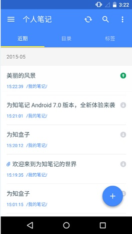
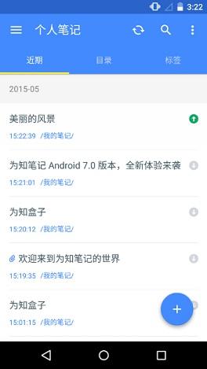
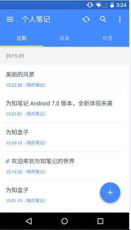

##同步数据
为知笔记 Android 客户端可通过以下两种方式手动同步数据
+ 下拉刷新同步数据
+ 点击同步按钮同步数据

##笔记同步状态
为知笔记 Android 客户端提供三种同步状态：待上传，待下载，已下载。

+ **待上传：** 当在没有网络的环境下创建了笔记，在笔记列表页，刚刚创建的笔记左侧会有红条存在，表示这篇笔记还没有上传到云端。在网络环境下，您可以将笔记同步到云端。只要笔记还没有上传到服务器，笔记列表左侧都会看到红条。

    

+ **待下载：** 如果笔记内容还没有从服务器下载到本地，笔记列表页左侧会看到蓝条存在。表示笔记数据还没有下载下来，目前只有标题数据。

    
 
+ **已下载：**  如果笔记已经下载到本地，那么在笔记列表页左侧，没有蓝条，也没有红条，只有笔记标题和笔记内容。

    

##同步机制
为知笔记各个客户端的同步机制
1. 在为知笔记客户端写的笔记信息，首先会保存在本地，同步之后保存到服务器；
2. 同一篇笔记在不同客户端编写会保存最后一个客户端同步成功的内容（注：经常手机电脑切换编辑同一篇笔记的用户，在切换客户端时要确保各个客户端都已经同步成功）
3.多个群组成员协同编辑同一篇笔记时，服务器上默认保存的版本是最后一个人上传的版本。（注：为了防止版本冲突发生，其中一个团队成员正在编辑一篇笔记，其他人在阅读此篇笔记时，会提示某某成员正在编辑该笔记，此时请不要编辑，待他同步之后再编辑）
