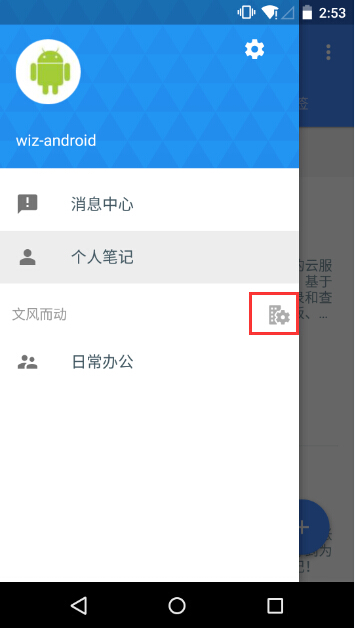

##团队管理及应用目录
+ <a href="#value" >团队应用带来的价值</a>
+ <a href="#manage">团队管理（群组管理；成员管理；团队设置）</a>
+ <a href="#role">团队角色权限说明</a>
+ <a href="#share">资料管理和共享</a>
+ <a href="#team">团队协作（团队沟通；协同编辑；简单的任务分配）</a>

##<a name="value">团队应用带来的价值</a>
####汇集团队经验智慧并传承下去--知识库、经验库
为知笔记帮助团队中的成员简单方便地把自己的知识经验记录下来并分享到企业群组中。来自不同成员的知识逐步积累成一个团队知识库，在目录层级管理和强大搜索功能帮助下，团队成员可以随时随地找到自己需要的知识。
####随时随地进行沟通和协作</a>
为知笔记让团队形成一个“工作圈”，通过成员间的消息通知、笔记评论等功能，可以快速实现内部沟通交流。在多种笔记终端，尤其是手机终端的支持下，每个团队成员，无论何时何地都可以跟团队保持着工作上的紧密联系。
####管理变得更加高效和人性化
在为知笔记中，管理者可以通过各种终端随时随地浏览下属的工作笔记，了解他们的工作进展，并通过评论功能进行管理反馈。团队成员使用为知笔记创建各种类型的工作笔记，只需通过一个简单的@功能，就可以提交给上级领导，无需再依靠email和office，团队中的工作管理变得简单和高效。

##<a name="manage">团队管理</a>
Android客户端提供了简单明了的后台管理。创建好团队后可以通过创建者、团队管理员可以通过“团队管理”进入后台管理界面进行团队管理。 
团队后台管理包括：群组管理、成员管理和团队设置。
只有团队管理员和团队创建者才有权限完成团队管理的操作。

####群组管理
您可以利用群组管理完成新建群组、添加成员、和群组成员权限控制等操作。

####成员管理
您可以利用成员管理，执行添加团队成员，修改成员权限和昵称的操作

####团队设置
在团队设置里，可以更改团队信息

#### 群组管理

只有群组管理员、团队创建者、团队管理员才有权限完成群组管理的操作

如果您是以上三个权限中的一个，那么您可以到群组属性里找到“管理群组”的选项，点击完成群组管理的操作

在群组管理后台，您可以修改群组信息，可以编辑群组成员。

## <a name="role">权限说明</a>

**1.团队成员角色**

成员角色，是指该用户在团队中的管理角色分两种：
+ 团队管理员
+ 普通成员

**创建者：**仅有一人，是团队最高管理者，角色不可改，具有最高权限

**2.成员权限是针对群组界定的** 
包括：
+ 群组管理员
+ 超级用户
+ 编辑
+ 作者
+ 读者

**更多详细说明请点击：**[企业服务 团队成员角色与群组权限对比说明](http://blog.wiz.cn/team-role-auth.html)

## <a name="share">资料管理和共享</a>
####搭建目录
手机端支持创建根目录、子目录。可以在群众下搭建适合自己公司的目录结构。
+ 点击目录页右上角的“创建目录”按钮，创建根目录
+ 长按根目录，创建它的子目录

####管理目录（建议在Windows、Mac或Web端进行）

####导入资料
大批量的资料导入建议在电脑客户端或者Web端进行，手机端可以用来写一些工作日志，或者外出的记录和图片。同时可以导入多种文件格式的附件。

## <a name="team">团队协作 </a>
####消息通知
在群众里，可以通过以下方式在消息中心接受到消息通知
+ **标题@** 
群组下所有有编辑权限的成员，都可以新建、编辑群组内的笔记。新建方式和新建个人笔记一样。唯一的不同是，您在群组里新建笔记，可以在标题里@别人，这样对方就可以收到消息，然后查看这篇笔记了

+ **评论或者评论中@成员** 
笔记评论功能，是在多人协作场景时，为用户提供对他人或自己笔记的评价、补充、批注等行为的功能。同时可以在评论中@成员把这个消息同时发给非笔记的作者。你可以像回复微博或论坛一样使用此特性。 
在手机端的阅读界面，点击顶端右上角的评论图标，查看或者添加评论

+ ** 编辑群组笔记** 
对于群组里的笔记，只要有权限，就可以编辑笔记。当看到某一处有错误的您可以编辑改正；当需要在笔记里添加或者删除一些内容，可以编辑修改。您编辑了的笔记，笔记的作者会受到消息。作者会第一时间收到，他的笔记被更改了的消息。
+ **接收消息** 
在手机端可以通过@，评论、编辑等功能发给团队成员的消息。可以通过消息中心收到消息。在Android端的主页，点击消息中心会跳到全部消息的列表。
默认展示所有的消息
通过顶端的下拉功能，过滤不同类型的消息。

####协同编辑
为知笔记可以提供多人编辑一篇笔记，来提高团队工作效率。但是，这里需要注意当一个成员在编辑的时候，另外的客户端会出现**成员正在编辑笔记，此时不要进行编辑。待该成员保存成功后再编辑。
####简单的任务分配
如果作为领导的你这在外出，但是需要做一些简单的任务分配给员工，可以通过Android客户端的任务清单功能，分配一下任务

