### 安装图形化操作系统

#### 系统安装

1. 启动安装光盘以后，显示自动进入liveCD界面的倒计时，由于我们需要在硬盘上安装操作系统，因此在倒计时结束前按回车键，进入菜单选择界面

    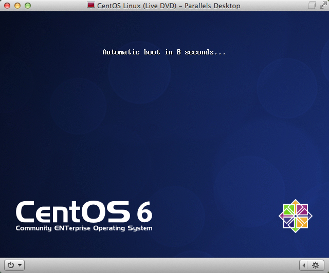

1. 进入菜单选择界面，如下图所示，这些选项含义分别是：

    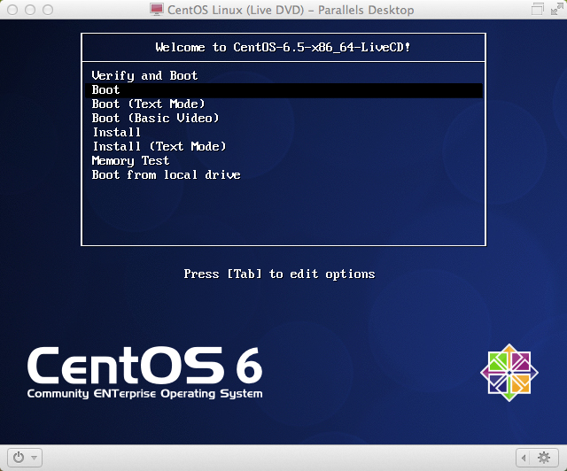

    1. Verify and Boot : 验证和启动
    1. Boot : 启动
    1. Boot (Text Mode) : 文本模式启动
    1. Boot (Basic Video) : 图形模式启动
    1. Install : 安装
    1. Install (Text Mode) : 安装（文本模式）
    1. Memory Test : 内存测试
    1. Boot from local drive : 从本地硬盘启动

    使用方向键选择第5项 Install，将系统安装到本地硬盘。

1. 经过安装程序的自检过程以后，进入系统安装引导程序的界面：

    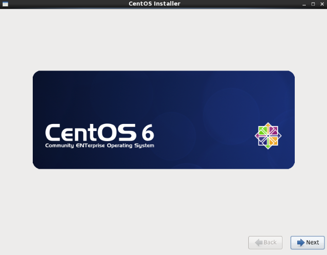

1. 点击右下角的" Next "，进入到语言选择界面，不熟悉英文的用户可以选择中文简体

    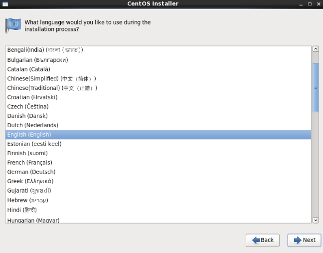

1. 点击右下角的" Next "，进入到键盘选择界面，使用默认的“美国英语式”即可

    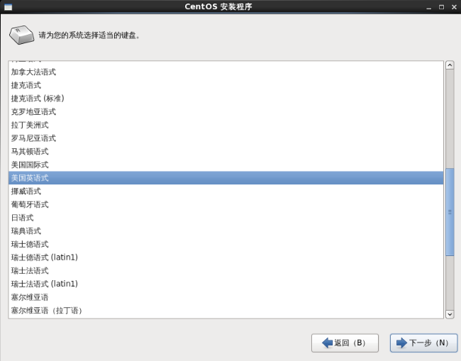

1. 点击右下角的"下一步"，进入到存储设备选择选择界面，使用默认即可

    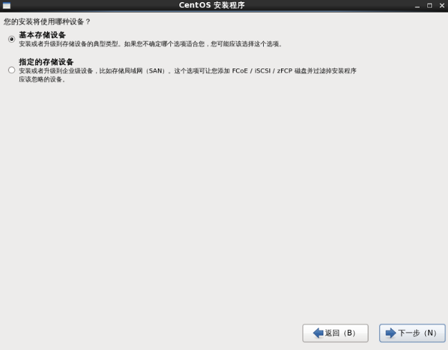

1. 点击右下角的"下一步"，会请用户确认是否要格式化指定磁盘，请确认该磁盘不包含有用的数据，然后选择“是，忽略所有数据”

    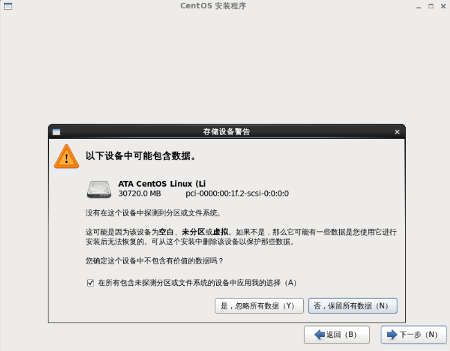

1. 选择“是，忽略所有数据”以后，进入设置机器名界面，为操作系统设置一个名称，建议选择一个方便记忆的有意义的名称

    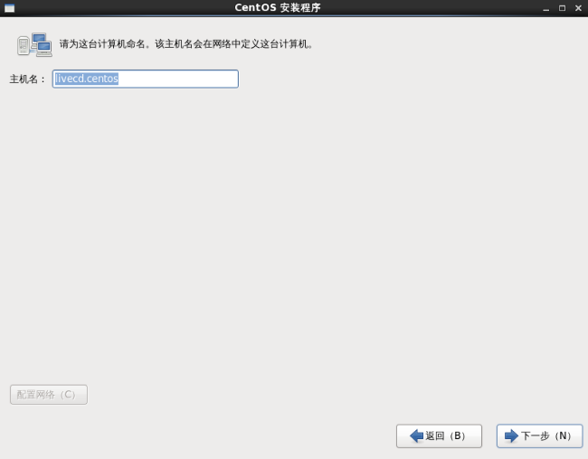

1. 点击右下角的"下一步"，进入地区设置界面，选择一个时区

    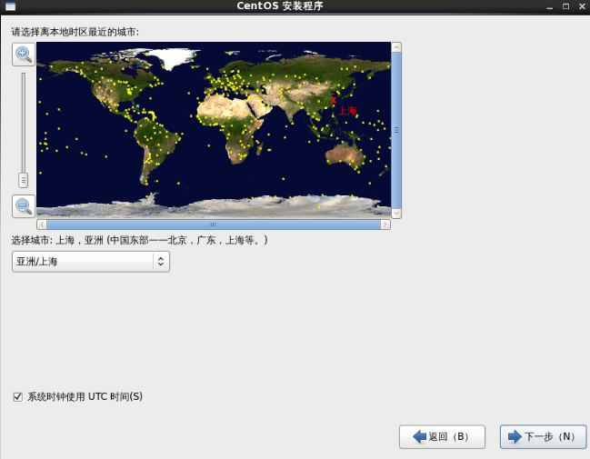

1. 点击右下角的"下一步"，进入管理员用户密码设置界面，建议设置一个强壮的密码

    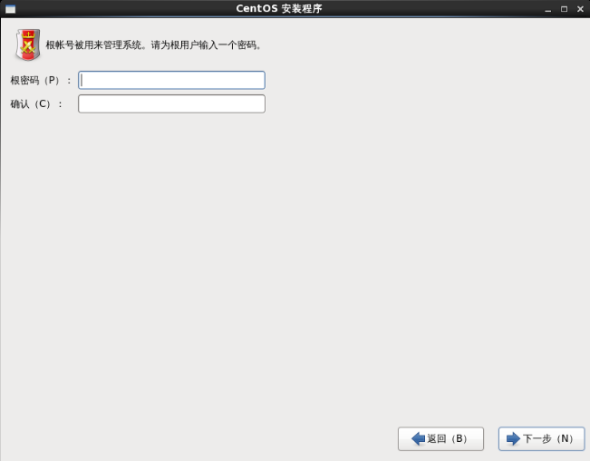

1. 点击右下角的"下一步"，进入选择安装类型界面，使用默认即可，如果需要对系统的磁盘进行分配，勾选左下角的“查看并修改分区布局”

    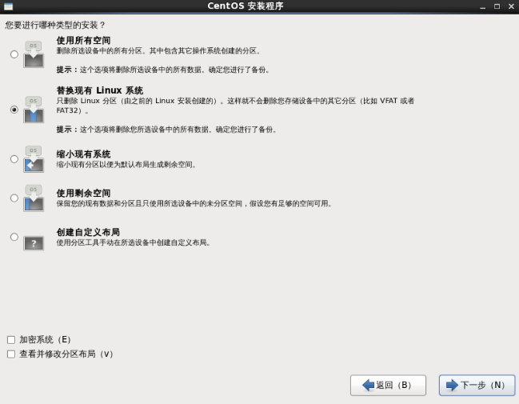

1. 如果上一步勾选了“查看并修改分区布局”，将进入分区设置界面，建议有经验的用户针对分区进行自定义，将私有部署使用的数据存储目录单独挂载，挂载建议参考[磁盘规划](./partition.html)

    

1. 点击右下角的"下一步"，会弹出格式化磁盘的确认对话框，点击确认后开始系统的安装

    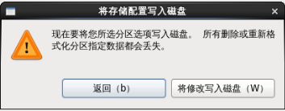

1. 安装完成界面

    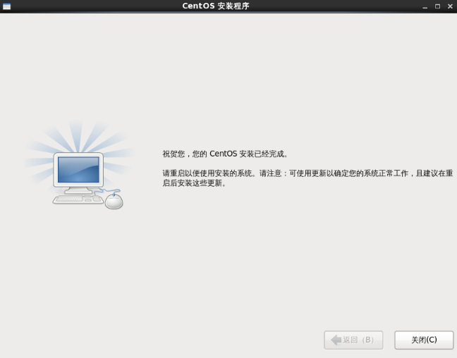

#### 系统配置

系统安装完成后还需要对其进行配置，配置过程的过程较简单，不再详细描述，“创建用户”的配置阶段可以直接跳过，另外建议关闭Kdump
    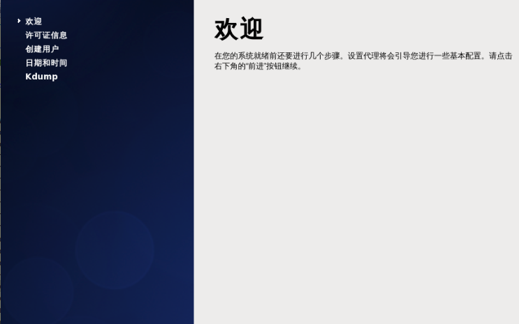

