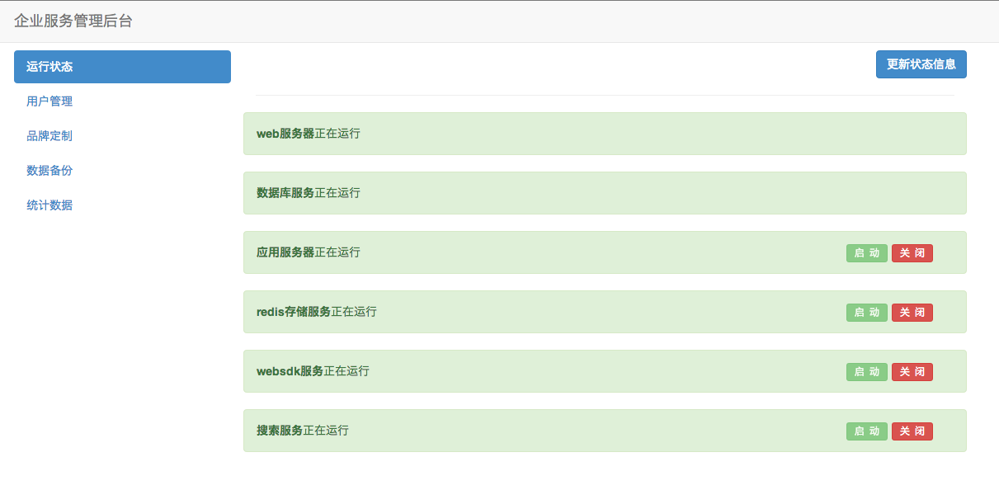
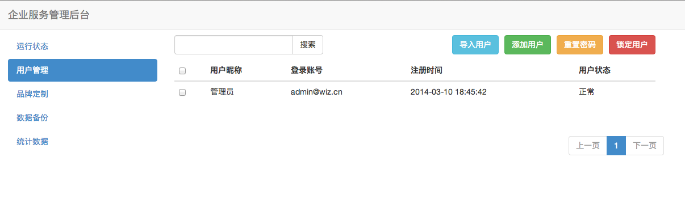
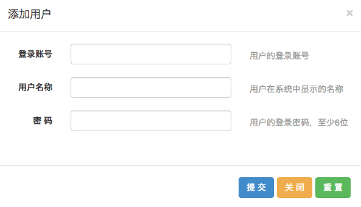
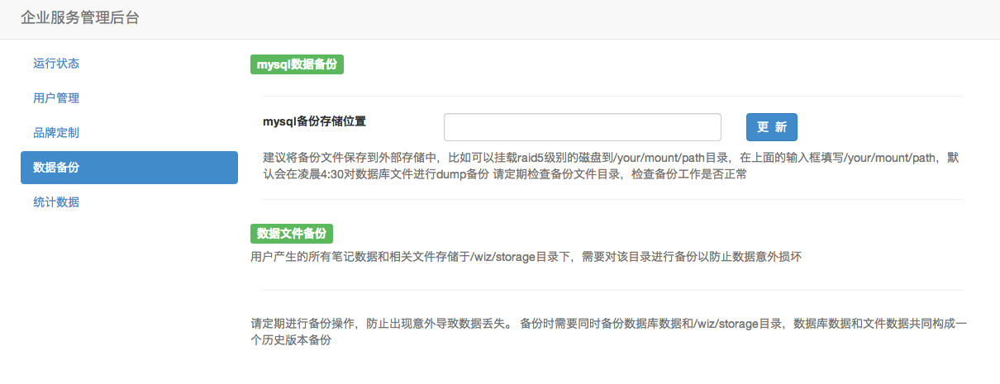
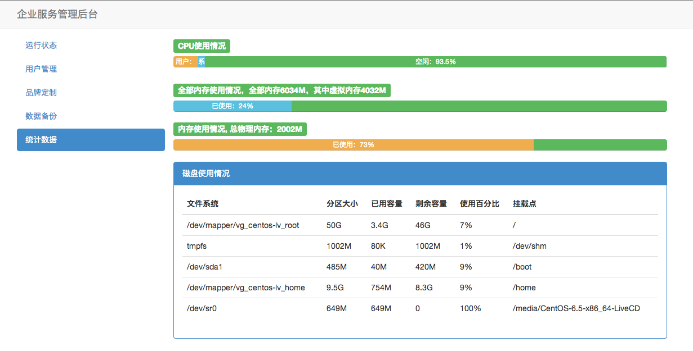

## 企业私有服务管理后台

可在登录页面进入企业私有部署的管理后台

### 管理后台的密码

管理后台的密码即为 admin@wiz.cn 用户的密码，如果该用户的密码被修改，那个登录管理后台的密码也相应改变。

### 管理后台功能

#### 查看服务运行状态

界面如图

可查看各个服务的运行状态，对部分服务可进行启动和关闭。状态非实时更新，点击“更新状态信息”按钮可以更新所有服务的状态信息。

#### 用户管理功能

可进行进行添加、批量导入、重置密码、锁定用户等操作。

+ 添加用户

    添加用户需要填写用户名（账号）、昵称、密码。

    

+ 批量导入用户

    下载提供的模板，模板为一个CSV文件，可以被excel或文本编辑器打开，填写用户信息，然后上传导入。

    

+ 重置用户密码

    将用户密码重置为123456

+ 锁定用户

    锁定用户，被锁定的用户将无法登录，但被锁定用户的所有笔记数据仍然存在。

    被锁定的用户无法解锁，请慎重使用。

#### 品牌定制

如果私有部署服务器更换了服务器地址或IP，可使用该功能更改服务器中的配置，效果相当于修改了配置文件/wiz/init.pp中的$openIp的值，该操作将更新所有配置文件，替换新的IP地址。

#### 备份数据

该页面只是提供一个方便的操作入口，并不能完全保证数据的安全性和备份成功。仍然需要人工检查和确保数据的备份工作。

在输入框中填写系统绝对路径，系统将使用crontab新建一个定时任务，每天凌晨4:30将数据库使用mysqldump命令备份到填写的绝对路径中。数据的安全性仍然需要其他措施来保证。

#### 系统状态

该页面提供了系统当前状况的简单展示，包括CPU、内存（包含和不包含虚拟内存）和硬盘的使用情况，默认情况下，将每3秒更新数据
