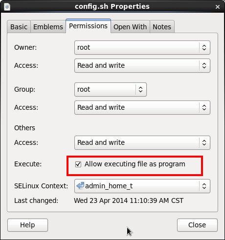
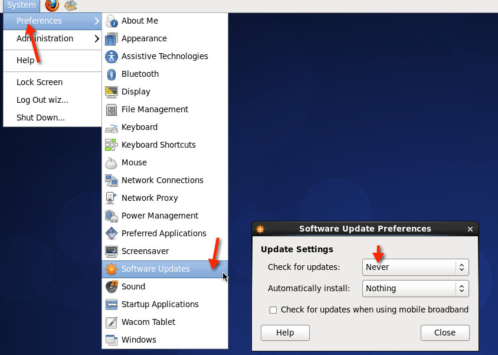
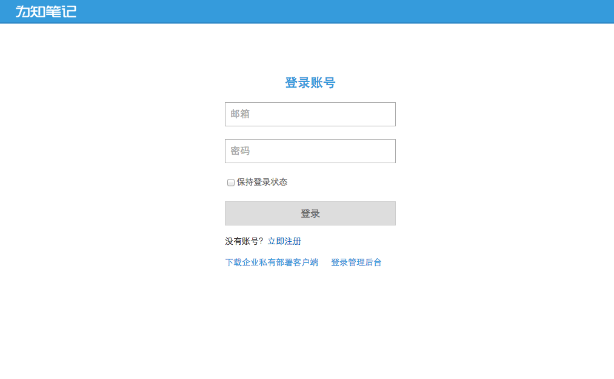

## 初始化系统环境

启动虚拟机里面的CentOS，并使用root用户登录（强烈建议）。*注意：推荐直接使用root用户登录，否则必须使用有sudo权限的账户。因为CentOS普通账户默认没有sudo权限，因此建议直接使用root账户登录*

打开下载的tar.gz文件，找到下面这个文件并解压缩出来（不需要解压缩完整的安装包，只需要解压缩出这一个文件）

```shell
wizenterprise/EnterpriseDeploy/config.sh
```

将上面的文件复制到CentOS里面的home目录里面（/root）。对于有图形界面的系统，并且安装了tools工具的虚拟机，可以直接将windows里面的文件拖动到虚拟机系统里面。如果没有图形界面，可以使用ssh之类的工具上传。

在CentOS里面，将config.sh增加可执行权限（图形界面：在config.sh上面点击右键，属性，可以增加可执行权限）。



在CentOS里面。打开终端程序，切换目录到home（默认就是），然后执行下面的命令：

```shell
ifconfig
```

记住当前的IP地址，如下面的 192.168.1.31，就是当前CentOS系统的ip地址：

```
[root@localhost ~]# ifconfig
eth0      Link encap:Ethernet  HWaddr 00:0C:29:8E:8D:CD
          inet addr:192.168.1.31  Bcast:192.168.1.255  Mask:255.255.255.0
          inet6 addr: fe80::20c:29ff:fe8e:8dcd/64 Scope:Link
          UP BROADCAST RUNNING MULTICAST  MTU:1500  Metric:1
          RX packets:84 errors:0 dropped:0 overruns:0 frame:0
          TX packets:18 errors:0 dropped:0 overruns:0 carrier:0
          collisions:0 txqueuelen:1000
          RX bytes:21540 (21.0 KiB)  TX bytes:1936 (1.8 KiB)

lo        Link encap:Local Loopback
          inet addr:127.0.0.1  Mask:255.0.0.0
          inet6 addr: ::1/128 Scope:Host
          UP LOOPBACK RUNNING  MTU:16436  Metric:1
          RX packets:28 errors:0 dropped:0 overruns:0 frame:0
          TX packets:28 errors:0 dropped:0 overruns:0 carrier:0
          collisions:0 txqueuelen:0
          RX bytes:2032 (1.9 KiB)  TX bytes:2032 (1.9 KiB)
```

然后执行下面的命令

```
./config.sh
```

脚本将会自动创建一个账户：wiznote，并要求您给这个账户设置密码。请按照提示输入两次密码（如果密码比较简单会有警告，可以忽略）。

然后再要求提示输入静态ip的地方，输入前面记录的ip地址，例如前面记录的ip地址：192.168.1.31（一定不要输入错误）。下面是这个脚本执行的一个例子：

```
[root@localhost ~]# ./config.sh
新建系统用户用于进行企业版的部署
用户名为wiznote
请设置并牢记该用户的登录密码
Changing password for user wiznote.
New password:
BAD PASSWORD: it is too simplistic/systematic
Retype new password:
passwd: all authentication tokens updated successfully.
请输入设置的静态ip地址:192.168.1.31
原始配置文件已备份至同目录下的bak文件
开始设置网络
DEVICE=eth0
BOOTPROTO=static
HWADDR=00:0C:29:8E:8D:CD
IPADDR=192.168.1.31
NETMASK=255.255.255.0
DNS1=192.168.1.1
GATEWAY=192.168.1.1
# Generated by NetworkManager
NETWORKING=yes
HOSTNAME=localhost.localdomain
Shutting down interface eth0:  Device state: 3 (disconnected)
                                                           [  OK  ]
Shutting down loopback interface:                          [  OK  ]
Bringing up loopback interface:                            [  OK  ]
Bringing up interface eth0:  Active connection state: activated
Active connection path: /org/freedesktop/NetworkManager/ActiveConnection/1
                                                           [  OK  ]
```

整个系统的初始化完成后，接下来就可以部署为知笔记企业私有部署了。

## 安装为知笔记服务程序

首先，需要重新启动CentOS系统，

**并使用wiznote账户登录（一定要使用这个账户，而不是root，否则可能会有错误，因为有些服务在root账户下面运行会有安全隐患，并且启动脚本中限制了使用普通用户来启动，使用root可能导致重启后服务无法正常启动）**。

图形界面的用户进入系统后，建议先禁用系统的自动升级，避免安装过程被系统的自动升级功能影响，防止安装失败。具体方式见下图：



然后将之前下载的为知笔记服务端程序（tar.gz文件），复制到CentOS的/home/wiznote目录里面，然后进行解压缩，通常目录结构为：

```
/home/wiznote/wizenterprise
```

接下来，找到下面这个文件：(如果目录结构不同，请自行更改)

```
/home/wiznote/wizenterprise/EnterpriseDeploy/puppet/modules/wiz-ent/manifests/init.pp
```

然后用gedit或者vi等打开这个文件并进行编辑，主要修改两个地方：

1. 企业名称，请修改成您自己的企业名称
1. 对外的ip地址，如下：
    ```
    $openIp = "192.168.1.31"
    ```

将这个地址修改成前面记录的ip地址。修改完这两个值之后，保存文件即可。

打开终端程序，切换到目录：

```shell
home/wiznote/wizenterprise/EnterpriseDeploy
```

需要注意的是，安装过程不是可重复执行的，一旦安装失败，就必须将系统还原到初始状态，如果使用虚拟机部署，最好先建立一份系统快照

确定前面的配置流程都已完成后，输入以下命令：

```shell
./install.sh
```

就会开始安装过程了。在这个过程中，脚本会自行安装所需要的服务，例如mysql，tomcat，nginx等。这个过程可能会比较长，请耐心等候。

**注意，如果在安装过程中发现很多下面的输出：**

```
Another app is currently holding the yum lock; waiting for it to exit...
  The other application is: PackageKit
    Memory : 131 M RSS (440 MB VSZ)
    Started: Wed Apr 23 11:19:27 2014 - 00:32 ago
    State  : Sleeping, pid: 5666
```

一般是因为CentOS后台在进行自动升级，导致无法正常安装一些服务。您可以一直等待，或者可以将CentOS的网络断开，一般就可以继续安装了。

等到安装完成后，您就可以通过浏览器直接访问部署好的企业服务了，例如在局域网内任意一台电脑通过浏览器打开（IP地址需要更换位前面记录的CentOS的IP地址）：

```
http://192.168.1.31
```

就可以看到为知笔记网页版登录地址了。在这个页面也可以直接下载为知笔记PC客户端（适用于您自己企业内部的）



## 内置账号和企业群组

私有部署中内置了一个管理账号，admin@wiz.cn，该账号默认密码为123456，建议修改默认密码。该账号拥有一个企业群组，建议使用该企业群组进行团队的交流和协作。

私有部署中内置了管理功能，在登录页面可以进入后台管理页面，使用admin@wiz.cn账号的密码进行登录。可以对群组成员进行管理，批量导入成员，查看各服务运行状态，设置数据库备份的定时任务，查看统计数据等操作。
