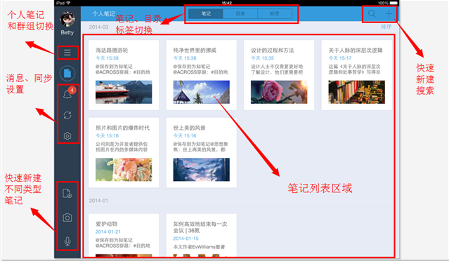

在主界面，你可以快速新建、查看、搜索笔记，还可以浏览目录、标签，也可以执行手动同步等操作。

#### 快速新建笔记
在这里，你可以通过两种方式实现快速新建笔记，您可以快速新建以下几种不同类型的笔记

***方式一：***区域 2 的方式

点击区域 2 中的 + 号，可以快速创建文本笔记

***方式二：*** 区域 3 的方式

区域 3 实际上是一个快速新建区域，你可以快速新建文本、拍照、录音等三种不同类型的笔记

#### 快速搜索笔记

点击区域 2 中的搜索图标，执行搜索操作

#### 切换到群组列表

点击区域 4 中的第一个按钮，从笔记列表页或消息页或其他页面，切换到群组列表页。

#### 快速浏览笔记和消息

+ 点击区域 4 中的第三个按钮，即消息中心按钮，可以快速切换到消息列表。
+ 上图中间区域为笔记列表展示区域，可以选择您想查看的笔记，点击完成阅读

#### 浏览目录和标签
打开为知笔记，默认展示笔记列表页，区域 1 是笔记、目录、标签的快速切换选项卡，可以点击目录或标签，浏览具体内容
