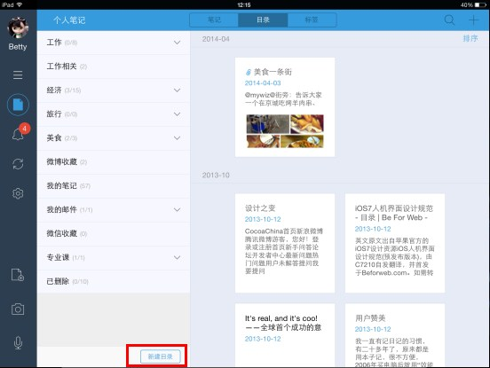
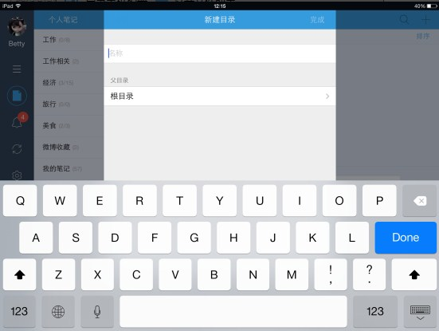
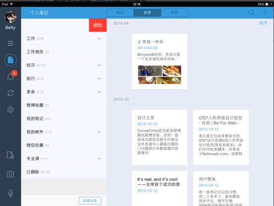
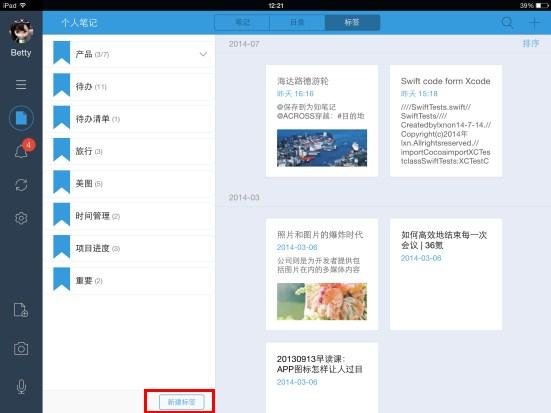
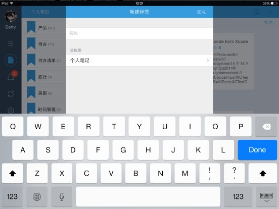

## 笔记目录
为知笔记支持多级目录功能，可以创建像电脑上文件夹一样的多级层级结构的目录，可以按自己的需求和使用习惯创建不同的根目录和子目录。

####  创建目录
端支持创建根目录、子目录
+ 点击目录页右上角的“创建目录”按钮，创建根目录
+ 如果想创建子目录，只需在父目录那里选择相应的根目录即可

    

    

#### 编辑目录
iPad端支持删除目录
+ 打开目录列表，从目录右边缘向左滑，完成删除目录操作

    

#### 查看目录下的笔记
+ 默认状态下，点击根目录会显示此根目录下所有子目录的笔记

##笔记标签（仅支持个人笔记）
给笔记添加标签的目的是把笔记按不同的属性分类，这样方便后期统一查找。
为知笔记支持多级标签，您可以按自己的需求和使用习惯给笔记添加根标签或子标签。
在iPad端，打开根标签，默认会显示根标签和子标签下的笔记，你也可以到设置里更改只显示根标签下的笔记。

#### 创建标签
手机端支持创建根标签、子标签
+ 点击标签页右上角的”添加标签“按钮，创建根标签
+ 如果您想创建子标签，只需在父标签那里选择相应的根标签即可
    

    

#### 编辑标签
手机端支持删除标签
+ 找到标签列表，从右边缘向左滑选择删除

#### 查看标签下的笔记
默认状态下，点击根标签会显示此根标签下所有子标签的笔记

