##新建笔记
为知笔记（ iPad 版）为您提供多种新建类型，包括：文本笔记、拍照笔记、录音笔记、富文本笔记，也可以直接将网页内容、微信内容、微博内容收藏到为知笔记。

####  如何新建笔记

笔记创建后，会保存到为知笔记，也会自动同步到云端。

+ 在笔记列表页，点击操作栏右上角的“+”号，创建新笔记

+ 打开为知笔记，在左侧的快捷区域，选择新建类型创建笔记

    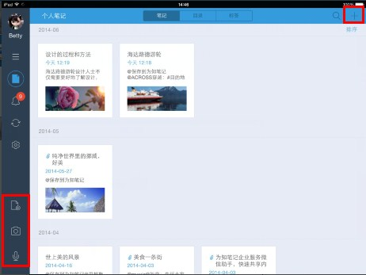

#### 新建笔记的类型

+ **文字笔记：**点击“新建笔记”按钮直接进入编辑器，进行文字编辑

    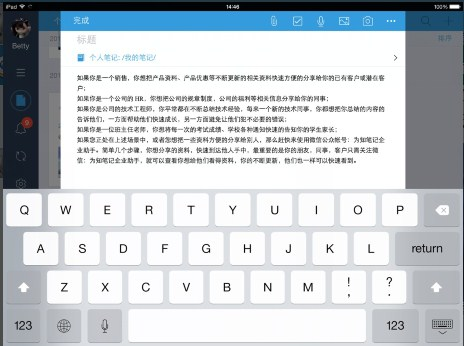

+ **拍照笔记：**点击“拍照”按钮会调用手机系统的相机或者您手机内安装的拍照系统开始拍照

    + 点击快捷区域的拍照按钮创建拍照笔记

        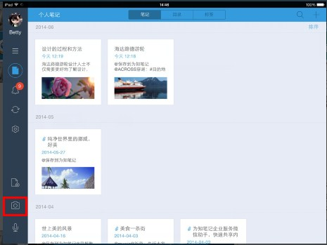

    + 点击 + 号后创建笔记，然后点击顶端操作栏上的拍照按钮创建拍照笔记

        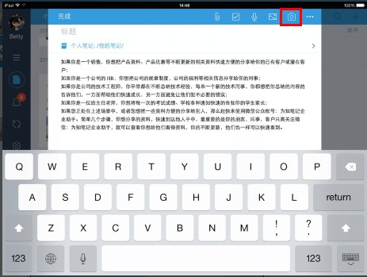

+ **录音笔记：**点击“录音”按钮直接开始录音，不管是处于待机状态还是打开为知笔记的状态，都会继续执行录音过程。

    + 点击快捷区域的录音按钮创建录音笔记

        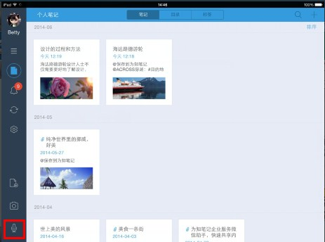

    + 点击 + 号后创建笔记，然后点击顶端操作栏上的录音按钮创建录音笔记

        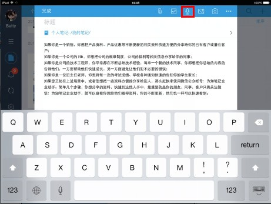

+ ** 待办清单：** 点击“待办清单”按钮，创建checklist

    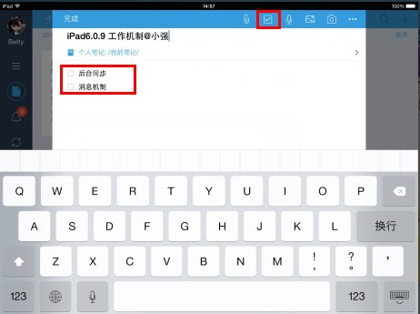
+ **富文本笔记：** 可以新建文字、图片、录音等各种类型都有的笔记。

##编辑笔记

阅读笔记时，点击底端的编辑图标，进入编辑页面

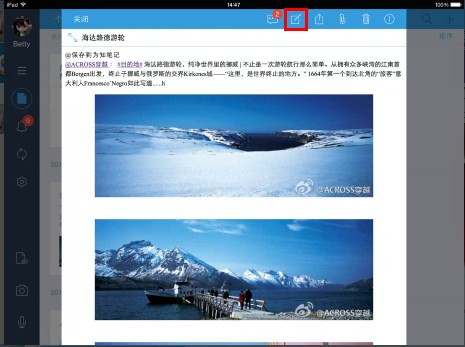

####编辑笔记内容
 点击左上角的对勾，保存修改；或者点击。。。里的放弃编辑，取消修改

+ 编辑内容

    + 编辑文字

    + 可以添加或者删除文字

    + 可以添加或删除图片

    + 可以添加或删除录音文件

+ 修改笔记信息

修改目录或笔记所在群组，可以直接点击标题上方的目录区域，也可以选择更多里的选择目录；修改笔记标签，选择更多里的选择标签进行修改（也可以在阅读笔记时选择笔记信息 i ，然后修改目录或标签）

+ 删除笔记

    阅读笔记，点击顶端的删除按钮即可删除笔记

+ 修改笔记信息

修改目录或笔记所在群组，可以直接点击标题上方的目录区域，也可以选择更多里的选择目录；修改笔记标签，选择更多里的选择标签进行修改（也可以在阅读笔记时选择笔记信息 i ，然后修改目录或标签）

####插入待办清单
1. **待办清单介绍**
    + 对于个人用户来说，你可以用待办清单记录你每天计划做的事情，计划完成的工作任务等等。

    + 对于团队协作来说，待办任务的完成状态是个结果性的标识，最终能够对协作和团队成员有重要帮助的，还是任务的执行过程，包括方案的选择和这样选择的原因，这些才是对团队最有价值的东西。所以为知笔记的待办清单更强调任务的一个执行过程。

        + 创建待办清单，将任务笔记发送消息给相关人，任务执行者的操作非常简单，勾选checkbox，即可标记任务完成，并记录人员和完成时间，关注任务最核心内容
        + 通过笔记评论和消息机制，跟踪任务执行过程中的问题、思路
        + 拖动其他相关笔记到任务正文，将与任务相关的笔记关联起来，例如任务来源、会议讨论记录、可参考的文档等

            

1. **如何使用待办清单进行协作**

    1. 创建待办清单笔记，在编辑界面，选择 checkbox 按钮，创建待办清单 （个人笔记按这个步骤创建待办清单列表即可） 
    1. 通过标题@相关人员，发送任务通知消息 
    1. 利用多人编辑，评论记录工作过程 
    1. 任务清单完成后，勾选复选框，自动记录执行人和执行时间

        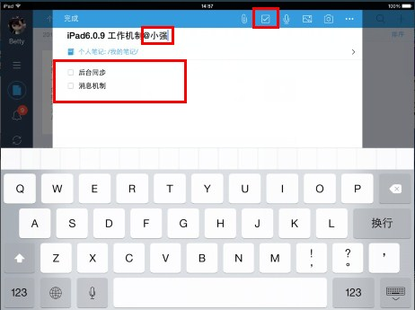

####添加笔记链接
+ 内链接

    +  内链接：笔记和笔记直接的关联

    +  添加内链接笔记：如果您想将两篇笔记关联起来，在阅读笔记时，点击分享按钮，选择复制链接到剪贴板，然后将链接粘贴到另一篇笔记的关联位置即可。

       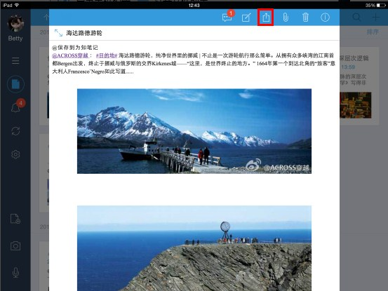

       

       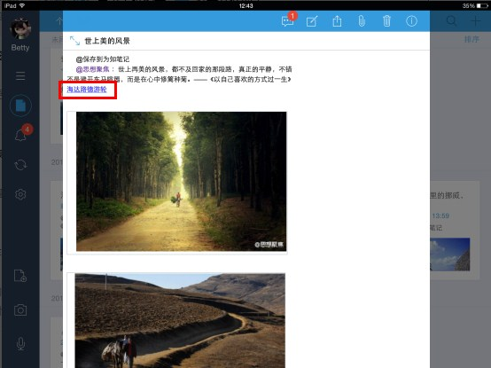

+ 外链接

    + 如果您的笔记是网页笔记，笔记内带有链接，那么在手机端可以点击链接查看对应网页内容。

    + 手机端暂不支持创建外链接，您复制链接地址，粘贴到笔记内，暂不支持转换成可点击链接形式。

####查看附件和编辑
为知笔记 iPad 端本身不支持对附件的编辑，如果您想在手机上编辑存到为知笔记的附件，您可以按以下方式执行

1. 先打开附件，然后选择可以编辑附件的应用程序打开对应附件，比如附件是 office 文件，可以选择 WPS 打开附件

1. 在第三方应用程序中编辑并保存附件

1. 在第三方应用程序中打开附件，选择通过“为知笔记”打开，这样编辑后的附件就保存到为知笔记了

    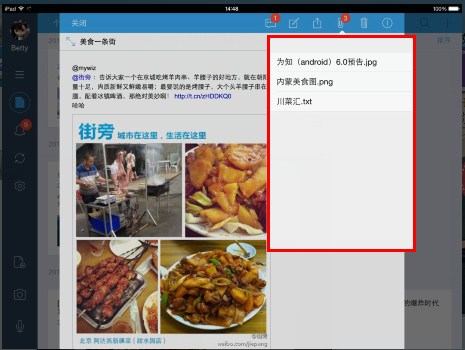

    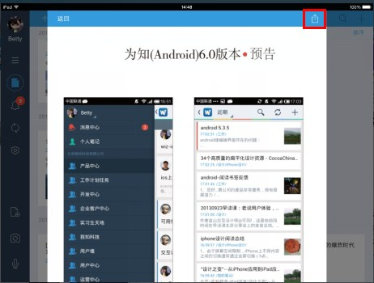

    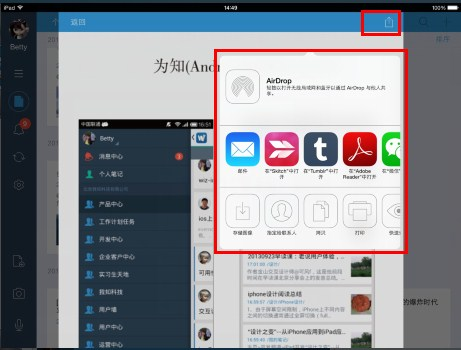

以上方法执行过程比较麻烦，建议尽量减少在移动端对附件的编辑操作。

## 删除笔记

阅读笔记时，点击顶端操作栏上的删除按钮，即可删除笔记
