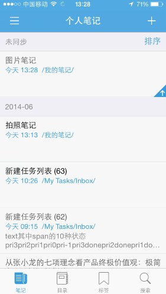

##同步数据
为知笔记 iPhone 客户端可通过两种方式同步数据
+ 下拉刷新同步数据
+ 点击同步按钮同步数据

##笔记同步状态
为知笔记 iPhone 客户端提供三种同步状态：待上传，待下载，已下载。

+ **待上传：** 当您在没有网络的环境下创建了笔记，在笔记列表页每条笔记就的右下角会看到待上传的图标。在网络环境下，您可以将笔记同步到云端。只要笔记还没有上传到服务器，笔记列表页每条笔记下边都有待上传图标。

+ **待下载：** 如果您的笔记内容还没有从服务器下载到本地，在笔记列表页，笔记的标题都是黑色的。表示笔记数据还没有下载下来，目前只有标题数据。

+ **已下载：** 如果笔记已经下载到本地，那么笔记列表页笔记标题和笔记摘要都是灰色字体

##同步机制
为知笔记各个客户端的同步机制
1. 在为知笔记客户端写的笔记信息，首先会保存在本地，同步之后保存到服务器；
2. 同一篇笔记在不同客户端编写会保存最后一个客户端同步成功的内容（注：经常手机电脑切换编辑同一篇笔记的用户，在使用另一客户端编辑笔记时一定要确保另一客户端已经同步成功）
3. 企业服务群组用户和团队成员同时编辑一篇笔记时，服务器上默认保存的版本是最后一个人上传的版本。（注：为了防止版本冲突发生，若您的团队成员正在编辑一篇笔记，您阅读此篇笔记时，会提示您对方正在编辑，此时请不要编辑，待他同步之后再编辑。此提示目前只有 Window、Mac客户端支持）

