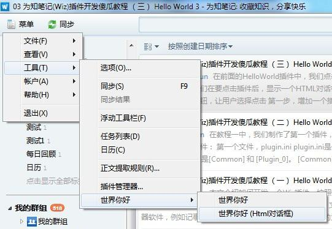
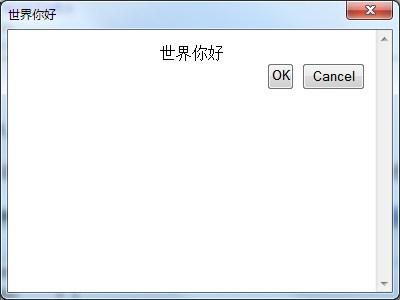

在前面的HelloWorld插件中，我们点击菜单后，直接执行了一个脚本。接下来，我们在要点击插件后，显示一个HTML对话框。在对话框里面，我们提供了确定和取消按钮，让用户选择点击

### 增加一个插件功能

打开plugin.ini，进行修改：

```
[Common]
FolderName=Hello.World
AppName=HelloWorldApp
AppName_2052=世界你好
AppName_1028=世界你好
AppGUID={edb64fbd-2255-408f-b690-f61e56cb9606}
AppType=Tools
AppVersion=1.0
PluginCount=2


[Plugin_0]
MenuType=Tools
Caption=Hello World
Caption_2052=世界你好
Caption_1028=世界你好
GUID={af91c3db-dc73-4538-b934-b591a6a69aff}
ScriptFileName=HelloWorld.js
Type=ExecuteScript


[Plugin_1]
MenuType=Tools
Caption=Hello World (Html Dialog)
Caption_2052=世界你好 (Html对话框)
Caption_1028=世界你好 (Html对话框)
GUID={6e073661-2a1a-4af0-ad56-abbc18c45666}
Type=HtmlDialog
HtmlDialogFileName=HelloWorld.htm
HtmlDialogTitle=Hello World
HtmlDialogTitle_2052=世界你好
HtmlDialogTitle_1028=世界你好
HtmlDialogWidth=400
HtmlDialogHeight=300
```

我们新增了一个插件内容，并且它的Type是HtmlDialog类型，同时增加了下面几个参数：

+ HtmlDialogFileName：点击菜单后，在对话框中显示的html文件名，可以是插件文件夹里面的一个html文件，也可以是一个远程的URL
+ HtmlDialogTitle：html对话框的标题，可以进行本地化。请参看[插件文件介绍](./course/plugin-file-introduce.md)
+ HtmlDialogWidth：对话框的宽度，单位是像素
+ HtmlDialogHeight：对话框的高度，单位是像素

### 编写Html对话框的内容

用记事本在插件目录，建立一个html文件，命名为：HelloWorld.htm，内容如下：

```
<html>
<head>
</head>
<body>
    <div align="center">
        世界你好</div>
    <div>
    </div>
    <div align="right">
        <input type="button" onclick="okClicked();" value="OK" />
        <input type="button" onclick="cancelClicked();" value="Cancel" />
    </div>

    <script>

        var objApp = window.external;
        //
        function okClicked() {
            alert("OK clicked");
            objApp.Window.CloseHtmlDialog(document, "ok");
        }

        function cancelClicked() {
            alert("Cancel clicked");
            objApp.Window.CloseHtmlDialog(document, "cancel");
        }
    </script>
</boby>
</html>
```

### 查看效果

重新启动为知笔记，然后依次点击 菜单>工具>世界你好>世界你好(Html对话框)，如下图：



出现下面的对话框：



点击 OK或者Cancel按钮，就可以关闭这个对话框了。

