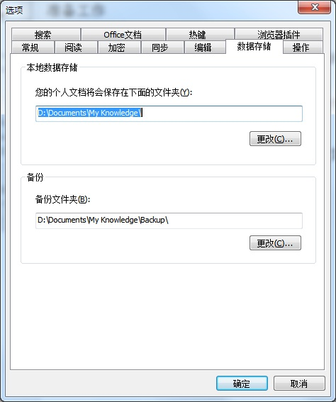
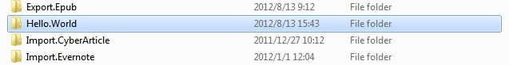
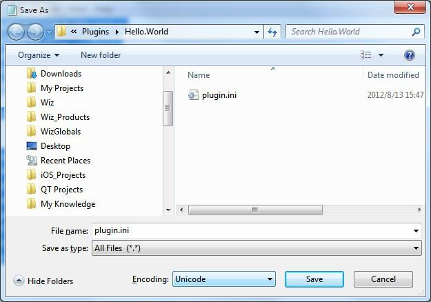
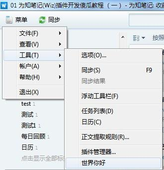
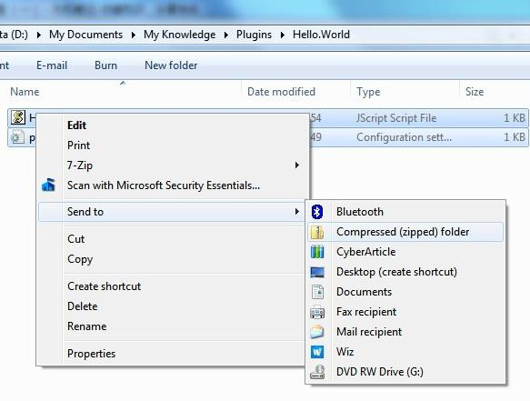
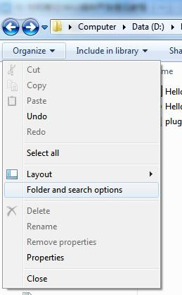
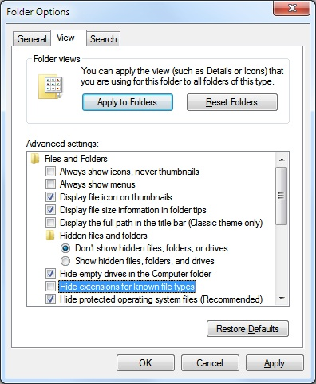

## 初始化插件目录

本文介绍如何开发一个Wiz插件。按照惯例，我们先写一个Hello World的例子。

### 准备工作

1. 为知笔记 3.0
1. 文本编辑器软件，例如记事本，NotePad+，等等

#### 找到你的为知笔记数据存储路径

例如我的：D:\Documents\My Knowledge

通常来说，在 我的文档\My Knowledge这个文件夹里面，如果你自己修改过，可以通过选项找到：



然后到这个文件夹，找到Plugins这个文件夹，如果没有，你可以直接建立这个文件夹：

例如我的：

D:\Documents\My Knowledge\Plugins

### 建立插件文件自己的文件夹

在上面Plugins的文件夹里面，建立一个 Hello.World这个文件夹，例如：



### 建立插件文件

然后进入该文件夹，在这里新建一个文件，命名为：plugin.ini

用记事本（也可以用其他文本编辑软件）打开这个文件，在记事本里面粘贴下面的内容：

```
[Common]
FolderName=Hello.World
AppName=HelloWorldApp
AppName_2052=世界你好
AppName_1028=世界你好
AppGUID={edb64fbd-2255-408f-b690-f61e56cb9606}
AppType=Tools
AppVersion=1.0
PluginCount=1


[Plugin_0]
MenuType=Tools
Caption=Hello World
Caption_2052=世界你好
Caption_1028=世界你好
GUID={af91c3db-dc73-4538-b934-b591a6a69aff}
ScriptFileName=HelloWorld.js
Type=ExecuteScript
```

然后在记事本中，选择菜单 文件 另存为，保存到plugin.ini。

注意，在另存为对话框中，选择选择文件编码是unicode，文件类型是*.*

如下图：



接下来，我们在这个文件夹，新建一个HelloWorld.js文件，内容如下：

```
var objApp = WizExplorerApp;
var objWindow = objApp.Window;
objWindow.ShowMessage("世界你好", "我的第一个为知笔记插件", 0x40);
```


同样，把这个文件保存成unicode编码的文件。

接下来，重新启动为知笔记。依次点击 菜单 工具 世界你好，就可以看到我们的插件效果：



点击菜单后，出现一个消息框：


### 制作插件安装文件

我们做好了插件，如何让别人也可以使用这个插件呢？那就需要制作插件安装文件，并把这个插件上传到为知笔记应用中心，让别人下载使用。

首先，进入插件文件夹，全选里面的文件，然后在文件上面点击右键，在菜单中 选择 发送到 压缩文件夹(zip)，如下图：



然后把文件扩展名重命名为 wizplugin，如下图：


注意：有些电脑无法显示扩展名，也就无法更改文件扩展名，您需要到文件夹选项里面更改选项，让windows可以显示文件扩展名：



在对话框里面，取消下面的这个选项，然后确定。



### 上传到为知笔记应用中心

用浏览器打开[为知笔记应用中心](http://app.wiz.cn)，点击发布新插件，登录后就可以发布新刚做好的插件了。
