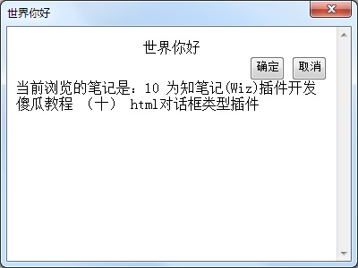
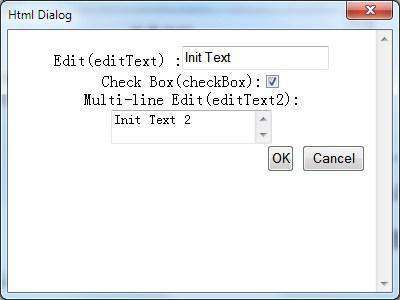

为知笔记提供了html对话框类型的插件，在制作这样的插件的时候，利用dhtml，可以实现一些复杂的界面。

在 [弹出对话框](./course/create-dialog.md) 里面，我们已经简单实现了一个html对话框插件，接下来，我们实现一个更复杂的功能，例如如何在对话框里面显示另外一个或者多个对话框。在这里，我们仍然使用Hello World这个插件。

### html对话框里面访问为知笔记内部对象

打开helloworld.htm文件，修改里面的脚本：

```
var objApp = window.external;
objApp.PluginLocalizeHtmlDialog(document);

// -------
var objDocument = objApp.Window.CurrentDocument;
if (objDocument) {
    var html = "<div>当前浏览的笔记是：" + objDocument.Title + "</div>";
    document.write(html);
}
// -------

var objDocument = objApp.Window.CurrentDocument;

function okClicked() {
    alert(objApp.LoadPluginString2(document, "OK clicked"));
    objApp.Window.CloseHtmlDialog(document, "ok");
}

function cancelClicked() {
    alert(objApp.LoadPluginString2(document, "Cancel clicked"));
    objApp.Window.CloseHtmlDialog(document, "cancel");
}
```

虚线间部分部分，显示了一个如何获得为知笔记当前打开的笔记的方法。我们在对话框里面显示了当前正在打开的笔记。



### 在对话框里面显示一个新的对话框



我们将要在helloworld.htm里面，增加一个新的按钮。当用户点击这个按钮的时候，会出现一个新的对话框。

首先使用一些网页编辑工具，或者直接输入代码，给helloworld.htm增加一个按钮，并且增加点击事件消息：

```
<html>
<head>
</head>
<body>
    <div align="center">
        <span id="labelHelloWorld">Hello World</span></div>
    <div>
    </div>
    <div align="right">
        &nbsp;<input id="buttonShowDialog" type="button" value="Show Dialog..." onclick="return buttonShowDialog_onclick()" />&nbsp;&nbsp;
        <input type="button" onclick="okClicked();" value="OK" id="buttonOK" />
        <input type="button" onclick="cancelClicked();" value="Cancel" id="buttonCancel" />
    </div>
    <script>
        var objApp = window.external;
        objApp.PluginLocalizeHtmlDialog(document);
        var objDocument = objApp.Window.CurrentDocument;
        if (objDocument) {
            var html = "<div>当前浏览的笔记是：" + objDocument.Title + "</div>";
            document.write(html);
        }
        function okClicked() {
            alert(objApp.LoadPluginString2(document, "OK clicked"));
            objApp.Window.CloseHtmlDialog(document, "ok");
        }
        function cancelClicked() {
            alert(objApp.LoadPluginString2(document, "Cancel clicked"));
            objApp.Window.CloseHtmlDialog(document, "cancel");
        }
        function buttonShowDialog_onclick() {

        }
    </script>
</boby>
</html>
```

首先在网页里面，增加了一个按钮，然后绑定了一个onclick事件。接下来我们来完成这个事件，打开另外一个对话框。

首先，我们设计另外一个对话框(html文件)，这个对话框里面，包含一些界面控件。用户操作后，将这些界面控件的状态，要传递给调用者，显示出来。

这个对话框的界面：

里面包含了一个文本编辑框，一个复选框，一个多行文本框。在用户点击确定后，我们还要把结果传递回调用者。

下面是html文件内容：

```
<html>
<head>
</head>
<body>
    <div align="center">Edit(editText) :<input id="editText" type="text" /><br />
        Check Box(checkBox):<input id="checkBox" type="checkbox" /><br />
        Multi-line Edit(editText2):<textarea id="editText2" cols="20" name="S1" rows="2"></textarea></div>
    <div>
    </div>
    <div align="right">
        &nbsp;<input type="button" onclick="okClicked();" value="OK" id="buttonOK" />
        <input type="button" onclick="cancelClicked();" value="Cancel" id="buttonCancel" />
    </div>
    <script>
        var objApp = window.external;
        var dialogInitParam = objApp.Window.GetHtmlDialogParam(document);
        if (dialogInitParam != null) {
            editText.value = dialogInitParam.editTextValue;
            checkBox.checked = dialogInitParam.checkBoxValue;
            editText2.value = dialogInitParam.editText2Value;
        }
        function okClicked() {
            //
            var dialogRet = {};
            dialogRet.editTextValue = editText.value;
            dialogRet.checkBoxValue = checkBox.checked;
            dialogRet.editText2Value = editText2.value;
            objApp.Window.CloseHtmlDialog(document, dialogRet);
        }
        function cancelClicked() {
            objApp.Window.CloseHtmlDialog(document, null);
        }
    </script>
</boby>
</html>
```

首先我们看一下如何初始化界面：

```
var objApp = window.external;
var dialogInitParam = objApp.Window.GetHtmlDialogParam(document);
if (dialogInitParam != null) {
    editText.value = dialogInitParam.editTextValue;
    checkBox.checked = dialogInitParam.checkBoxValue;
    editText2.value = dialogInitParam.editText2Value;
}
```

首先获得用于初始化对话框的一个参数：

```
var dialogInitParam = objApp.Window.GetHtmlDialogParam(document);
```

通过objWindow.GetHtmlDialogParam 可以获得用于初始化对话框的一个参数，该参数是开发人员指定，并通过objWindow.ShowHtmlDialog传递给被打开的对话框，利用这个参数，可以由打开对话框的程序向被打开的对话框传递数据，以便进行对话框初始化。

下面的代码，就是用于对话框的初始化：

```
if (dialogInitParam != null) {
    editText.value = dialogInitParam.editTextValue;
    checkBox.checked = dialogInitParam.checkBoxValue;
    editText2.value = dialogInitParam.editText2Value;
}
```

用户在对话框上面执行操作后，点击确定或者取消按钮，则将结果在作为objWindow.ShowHtmlDialog的返回值，以便调用者获得对话框的结果。

最后，我们修改HelloWorld.htm，增加显示对话框代码：

```
function buttonShowDialog_onclick() {

    var dialogInitParam = {};
    dialogInitParam.editTextValue = "Init Text";
    dialogInitParam.checkBoxValue = true;
    dialogInitParam.editText2Value = "Init Text 2";
    //
    var htmlDialogFileName = pluginPath + "HelloWorldDialog.htm";
    var ret = objApp.Window.ShowHtmlDialog("Html Dialog", htmlDialogFileName, 400, 300, "", dialogInitParam);
    //
    if (ret) {
        alert("OK clicked, dialog ret is:\editTextValue=" + ret.editTextValue + "\ncheckBoxValue=" + ret.checkBoxValue + "\neditText2Value=" + ret.editText2Value);
    }
    else {
        alert("cancel clicked");
    }

}
```

在这里的代码中，我们首先设置了一些初始的参数

```
var dialogInitParam = {};
dialogInitParam.editTextValue = "Init Text";
dialogInitParam.checkBoxValue = true;
dialogInitParam.editText2Value = "Init Text 2";
```

然后通过下面的代码，显示对话框，并且把初始化参数传入对话框：

```
var ret = objApp.Window.ShowHtmlDialog("Html Dialog", htmlDialogFileName, 400, 300, "", dialogInitParam);
```

然后对话框返回的结果，则作为函数返回值返回。

在对话框的代码中，用户点击OK和Cancel，返回的内容不同，如下：

```
function okClicked() {
    var dialogRet = {};
    dialogRet.editTextValue = editText.value;
    dialogRet.checkBoxValue = checkBox.checked;
    dialogRet.editText2Value = editText2.value;
    objApp.Window.CloseHtmlDialog(document, dialogRet);
}

function cancelClicked() {
    objApp.Window.CloseHtmlDialog(document, null);
}
```

在使用 objApp.Window.CloseHtmlDialog的时候，第一个参数，是当前对话框的document对象，第二个参数，是用于返回的返回值。

点击OK的时候，我们把对话框里面控件的值保存下来返回，而对于Cancel按钮，我们则返回一个null。

最后，当用户关闭对话框的时候，我们就可以把结果显示出来了：

```
if (ret) {
    alert("OK clicked, dialog ret is:\editTextValue=" + ret.editTextValue + "\ncheckBoxValue=" + ret.checkBoxValue + "\neditText2Value=" + ret.editText2Value);
}
else {
    alert("cancel clicked");
}
```

从本次教程可以看到，在为知笔记里面，显示一个对话框非常容易，而通过html/css/jquery等，也可以设计出非常漂亮的对话框界面。
