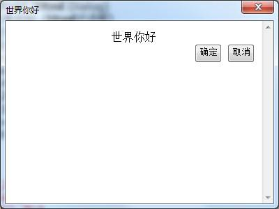
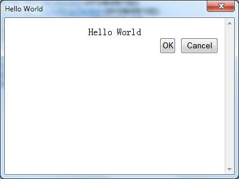

在前面的教程中，我们看到了一些本地化的功能，例如菜单文字，Html对话框标题，我们成功进行了本地化。接下来，我们要对Html对话框内容进行本地化。

### Html文件本地化


首先编辑HelloWorld.htm文件，进行如下修改：

```
<html>
<head>
</head>
<body>
    <div align="center">
        <span id="labelHelloWorld">Hello World</span></div>
    <div>
    </div>
    <div align="right">
        <input type="button" onclick="okClicked();" value="OK" id="buttonOK" />
        <input type="button" onclick="cancelClicked();" value="Cancel" id="buttonCancel" />
    </div>

    <script>

        var objApp = window.external;
        objApp.PluginLocalizeHtmlDialog(document);
        //
        function okClicked() {
            alert(objApp.LoadPluginString2(document, "OK clicked"));
            objApp.Window.CloseHtmlDialog(document, "ok");
        }

        function cancelClicked() {
            alert(objApp.LoadPluginString2(document, "Cancel clicked"));
            objApp.Window.CloseHtmlDialog(document, "cancel");
        }
    </script>
</boby>
</html>
```

Html对话框里面，所有的语言，我们都用了英文，这样在没有进行本地化支持的时候，全部显示成英文。

首先，我们给HelloWorld外边增加了一个span，并且给了他一个id，叫做labelHelloWorld，

同时，我们还给确定/取消按钮增加了id，分别是buttonOK, buttonCancel

接下来，我们修改脚本部分，增加了

```
objApp.PluginLocalizeHtmlDialog(document);
```

这一行语句，将会让Wiz来把界面上的文字描述部分，翻译成本地语言，例如中文。

在用户点击鼠标之后的提示文字，我们也增加了本地化：

```
alert(objApp.LoadPluginString2(document, "OK clicked"));
```
其中 `objApp.LoadPluginString2(document, "OK clicked")`，就是让Wiz翻译 OK Clicked 这个字符串。

### 在Plugin.ini里面增加本地化资源

接下来，打开plugin.ini文件，进行如下修改：

```
[Common]
FolderName=Hello.World
AppName=HelloWorldApp
AppName_2052=世界你好
AppName_1028=世界你好
AppGUID={edb64fbd-2255-408f-b690-f61e56cb9606}
AppType=Tools
AppVersion=1.0
PluginCount=2


[Plugin_0]
MenuType=Tools
Caption=Hello World
Caption_2052=世界你好
Caption_1028=世界你好
GUID={af91c3db-dc73-4538-b934-b591a6a69aff}
ScriptFileName=HelloWorld.js
Type=ExecuteScript


[Plugin_1]
MenuType=Tools
Caption=Hello World (Html Dialog)
Caption_2052=世界你好 (Html对话框)
Caption_1028=世界你好 (Html对话框)
GUID={6e073661-2a1a-4af0-ad56-abbc18c45666}
Type=HtmlDialog
HtmlDialogFileName=HelloWorld.htm
HtmlDialogTitle=Hello World
HtmlDialogTitle_2052=世界你好
HtmlDialogTitle_1028=世界你好
HtmlDialogWidth=400
HtmlDialogHeight=300


[Strings]
labelHelloWorld_2052=世界你好
buttonOK_2052=确定
buttonCancel_2052=取消
OK clicked_2052=点击了确定
Cancel clicked_2052=点击了取消
```

我们增加了 `[Strings]` 部分，并且对html对话框里面的资源进行了本地化。

其中对于html界面部分的组件，Wiz通过组件的id进行本地化。对于脚本里面的需要的字符串，则脚本可以直接指定。

2052等字符串的含义，请参考：
[Locale IDs Assigned by Microsoft](http://msdn.microsoft.com/en-us/goglobal/bb964664.aspx)

### 预览效果




