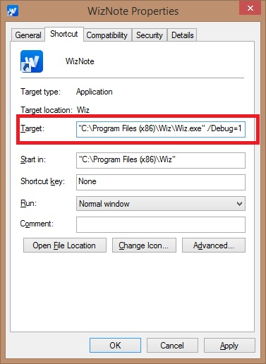
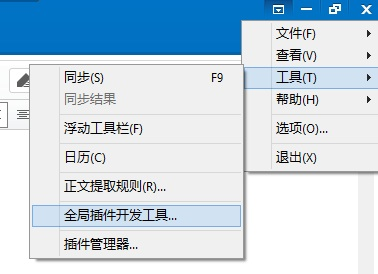

PC客户端从4.1开始，全面使用webkit内核。对插件机制进行了一些调整，因此，原有的插件，可能需要一些调整才可以使用。

### 为知笔记PC客户端的插件机制调整

对部分属性进行了修改，主要是包含参数的属性，之前在IE内核的js支持，但是Chrome内核不支持包含参数的属性，因此增加了通过方法来获取或者写入这些属性的功能。主要影响是：

1. WizDatabase.Meta ->SetMeta/GetMeta
1. WizDatabase.MetasByName ->GetMetasByName
1. WizDocument.ParamValue ->GetParamValue/SetParamValue
1. WizSettings.StringValue(IntValue, BoolValue)  -> GetStringValue/SetStringValue (GetIntValue/SetIntValue, GetBoolValue/SetBoolValue)
1. WizSettings.Section -> WizSettings.GetSection

### Webkit内核对插件编写的影响

主要是IE内核和Webkit内核的差异。主要的差异有以下几点：

1. new ActiveXObject 这个方法不能使用了，因为这个对象只有在IE内核在有效。可以改成WizExplorerApp.CreateActiveXObject。如果是全局插件，可以直接使用objApp，因为objApp与WizExplorerApp是等价的，如果不是全局插件，可以使用window.external来获得WizExplorerApp。
1. 所有wiz内部对象，都需要使用objApp.CreateWizObject来取得，因为不再可以使用new ActiveXObject。
1. attachEvent需要转换成addEventListener，需要注意的是addEventListioner的第一个参数Event不加on。
1. document.parentWindow不再支持（Webkit内核），另外，document.defaultView方式获取window对象也不支持。如果需要使用window对象的功能，请使用其他方式解决。

### 对插件编写的增强

可以使用Chrome开发工具来调试了。对于对话框类型的插件，可以直接在对话框上面按下F12，就可以直接显示开发工具了。Wiz内部对象也可以直接在console里面查看。

对于全局插件的调试，可以启用Wiz的debug模式，这时候将会在菜单中出现全局插件开发工具，可以显示插件所在的网页的开发控制台。

Debug模式开启：启动wiz的时候，增加命令行参数： Wiz.exe /Debug=1 (注意.exe 和/Debug中间有一个空格)。可以直接给快捷方式增加参数：

