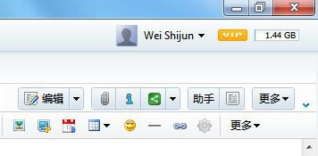
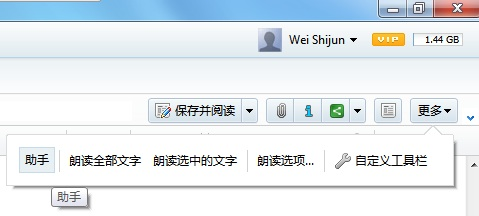
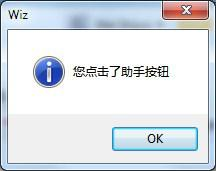
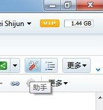

写在前面：Wiz助手插件在Wiz 1.x的时候就有了，该插件早期版本比较简单，后来经过众多网友开发，衍生出众多版本。这次教程里面，进行重新修订，仅用于学习插件开发。如果需要最新的助手插件，请到为知笔记应用中心下载。

### 助手插件简介

该插件全面增强了为知笔记功能，例如包含了设置关键字，阅读状态下面进行批注，标签云等等。

### 给笔记阅读上方工具栏增加一个按钮

类似大纲插件，我们在笔记工具栏上面增加一个按钮，就叫做 “助手”，点击这个按钮后，出现一个下拉窗口，在上面录入关键字和作者信息。

plugin.ini内容：

```
[Common]
FolderName=Tools.Helper
AppName=WizNote Helper
AppName_2052=为知笔记助手
AppGUID={03fc90fb-ff38-48dd-b268-6bd65f8d9d0f}
AppType=Helper
AppVersion=1.0
PluginCount=1

[Plugin_0]
Caption=WizNote Helper
Caption_2052=为知笔记助手
Caption_1028=为知笔记助手
GUID={36826ce3-13ae-441c-9c02-43c8c4dc0327}
ScriptFileName=helper.js
Type=Global

[Strings]
strHelper=Helper
strHelper_2052=助手
strHelper_1028=助手
```

helper.js内容

```
function OnHelperButtonClicked() {
    WizAlert("您点击了助手按钮");
}

function InitHelperButton() {
    var pluginPath = objApp.GetPluginPathByScriptFileName("helper.js");
    var languangeFileName = pluginPath + "plugin.ini";
    var buttonText = objApp.LoadStringFromFile(languangeFileName, "strHelper");
    objWindow.AddToolButton("document", "HelperButton", buttonText, "", "OnHelperButtonClicked");
}
InitHelperButton();
```

在这里我们用到了一个新的方法：objWindow.AddToolButton。这个方法，可以向为知笔记主工具栏或者笔记阅读工具栏增加一个按钮。

```
HRESULT AddToolButton([in] BSTR bstrType, [in] BSTR bstrButtonID, [in] BSTR bstrButtonText, [in] BSTR bstrIconFileName, [in] BSTR bstrClickEventFunction);
```

+ bstrType：按钮的类型，目前仅支持文档类型的按钮，可以是document或者main
+ document：给笔记阅读上方的工具栏增加按钮
+ main：给助工具栏增加按钮
+ bstrButtonText：按钮文字
+ bstrIconFileName：按钮的图标，可以为空
+ bstrClickEventFunction：按钮点击后执行的函数，就是当前js文件里面的一个函数，我们指定了OnHelperButtonClicked 这个函数。

我们保存所有文件，然后重新启动为知笔记，就可以看到按钮了。



注意：为知笔记3.0允许自定义工具栏，因此如果在笔记上方没有出现这个按钮，可以点击 更多 按钮，将会出现助手按钮，也可以重新自定义，允许显示助手按钮。



点击按钮，可以看到下面的消息框：



为了美观，我们可以给这个按钮增加一个图标。首先，我们去创作或者找一个ico文件作为图标，命名为helper.ico，并放在插件目录里面，然后修改helper.js代码：

```
function OnHelperButtonClicked() {
    WizAlert("您点击了助手按钮");
}

function InitHelperButton() {
    var pluginPath = objApp.GetPluginPathByScriptFileName("helper.js");
    var languangeFileName = pluginPath + "plugin.ini";
    var buttonText = objApp.LoadStringFromFile(languangeFileName, "strHelper");
    var iconFileName = pluginPath + "helper.ico";
    objWindow.AddToolButton("document", "HelperButton", buttonText, iconFileName, "OnHelperButtonClicked");
}
InitHelperButton();
```

修改之后，重新启动为知笔记，就可以看到效果了：



为了美观，我们可以给这个按钮增加一个图标。首先，我们去创作或者找一个ico文件作为图标，命名为helper.ico，并放在插件目录里面，然后修改helper.js代码：

```
function OnHelperButtonClicked() {
    WizAlert("您点击了助手按钮");
}

function InitHelperButton() {
    var pluginPath = objApp.GetPluginPathByScriptFileName("helper.js");
    var languangeFileName = pluginPath + "plugin.ini";
    var buttonText = objApp.LoadStringFromFile(languangeFileName, "strHelper");
    var iconFileName = pluginPath + "helper.ico";
    objWindow.AddToolButton("document", "HelperButton", buttonText, iconFileName, "OnHelperButtonClicked");
}
InitHelperButton();
```

修改之后，重新启动为知笔记，就可以看到效果了：

### 给按钮增加响应事件

目标：实现给文档设置作者，关键字，打星标，同时能够实现文档中自动给出现的关键字或者作者增加链接，点击后列出相关的文档（类似将标签转换为链接的功能）。

同时将标签转换为链接的插件功能包含进来。

### 给按钮增加响应事件

目标：实现给文档设置作者，关键字，打星标，同时能够实现文档中自动给出现的关键字或者作者增加链接，点击后列出相关的文档（类似将标签转换为链接的功能）。

同时将标签转换为链接的插件功能包含进来。

1. 允许给文档设置作者，关键字，打星标。
    首先我们应该在用户点击知识管理按钮的时候，显示一个下拉窗口，在里面完成上面的工作。
    打开helper.js文件，编辑内容：

    ```
    function OnHelperButtonClicked() {
        var pluginPath = objApp.GetPluginPathByScriptFileName("helper.js");
        var helperHtmlFileName = pluginPath + "helper.htm";
        //
        var rect = objWindow.GetToolButtonRect("document", "HelperButton");
        var arr = rect.split(',');
        objWindow.ShowSelectorWindow(helperHtmlFileName, arr[0], arr[3], 350, 500, "");
    }

    function InitHelperButton() {
        var pluginPath = objApp.GetPluginPathByScriptFileName("helper.js");
        var languangeFileName = pluginPath + "plugin.ini";
        var buttonText = objApp.LoadStringFromFile(languangeFileName, "strHelper");
        var iconFileName = pluginPath + "helper.ico";
        objWindow.AddToolButton("document", "HelperButton", buttonText, iconFileName, "OnHelperButtonClicked");
    }
    InitHelperButton();
    ```

    红色部分的代码，实现了用户点击按钮的时候，现实一个下拉窗口。下拉窗口显示的内容，就是helper.htm文件。我们在插件文件夹里面，建立一个helper.htm文件，用html编辑器或者文本编辑器，编辑该文件，实现下面的界面：

    用户可以在这里输入关键字，作者，打星标的功能，通过可以通过关键字或者作者搜索相关的文档。
    helper.htm里面的关键代码：
    ```

    /*
    Wiz显示插件html窗口的时候（如html对话框或者下拉框），html窗口的external对象，就是WizExplorerApp对象。
    通过这个对象，可以获得当前正在运行的Wiz的一些内部对象，并调用Wiz的响应功能。
    */
    var objApp = window.external; //WizExplorerApp
    var objDatabase = objApp.Database;
    var objWindow = objApp.Window;
    var objDoc = objWindow.CurrentDocument; //获得当前正在浏览的Wiz文档(WizDocument)
    var objHtmlDocument = objWindow.CurrentDocumentHtmlDocument;    //获得当前正在浏览的html网页的document对象(IHTMLDocument2)
    //
    var pluginPath = objApp.GetPluginPathByScriptFileName("helper.js"); //获得插件的路径
    var languangeFileName = pluginPath + "plugin.ini";  //语言文件
    ```
    上面的代码可以看到，如何在下拉窗口里面，获得为知笔记内部对象

    其中打星标的功能，是从网上搜索的，就不再描述了。这个html文件展示了插件对话框或者下拉框，如何和Wiz进行交互，获得Wiz的一些内部接口。

1. 给文档中出现的关键字，作者，标签增加链接，在用户点击后，列出相应的文档供用户浏览。

    首先，还是打开helper.js，进行如下修改：

    ```
    function OnHelperButtonClicked() {
        var pluginPath = objApp.GetPluginPathByScriptFileName("helper.js");
        var helperHtmlFileName = pluginPath + "helper.htm";
        //
        var rect = objWindow.GetToolButtonRect("document", "HelperButton");
        var arr = rect.split(',');
        objWindow.ShowSelectorWindow(helperHtmlFileName, arr[0], arr[3], 350, 500, "");
    }

    function InitHelperButton() {
        var pluginPath = objApp.GetPluginPathByScriptFileName("helper.js");
        var languangeFileName = pluginPath + "plugin.ini";
        var buttonText = objApp.LoadStringFromFile(languangeFileName, "strHelper");
        var iconFileName = pluginPath + "helper.ico";
        objWindow.AddToolButton("document", "HelperButton", buttonText, iconFileName, "OnHelperButtonClicked");
    }
    InitHelperButton();

    /*
    文档关键字高亮代码
    */

    var HelperHighlighter = function(colors) {
        this.colors = colors;
        if (this.colors == null) {
            //默认颜色
            this.colors = ['#ffff00,#000000', '#dae9d1,#000000', '#eabcf4,#000000',
      '#c8e5ef,#000000', '#f3e3cb, #000000', '#e7cfe0,#000000',
      '#c5d1f1,#000000', '#deeee4, #000000', '#b55ed2,#000000',
      '#dcb7a0,#333333', '#7983ab,#000000', '#6894b5, #000000'];
        }
    }

    HelperHighlighter.prototype.highlight = function(doc, node, keywords, callback) {
        if (!keywords || !node || !node.nodeType || node.nodeType != 1)
            return;

        keywords = this.parsewords(keywords);
        if (keywords == null)
            return;
        //
        var text = node.innerText;
        //
        for (var i = 0; i < keywords.length; i++) {
            if (-1 == text.indexOf(keywords[i].word))
                continue;
            this.colorword(doc, node, keywords[i], callback);
        }
    }
    HelperHighlighter.prototype.colorword = function(doc, node, keyword, callback) {
        if (node.childNodes == undefined)
            return false;
        //
        if (node.name == "wizHelperHighlighterSpan")
            return false;
        //
        for (var i = 0; i < node.childNodes.length; i++) {
            var childNode = node.childNodes[i];
            if (childNode.nodeType == 3) {
                //childNode is #text
                var re = new RegExp(keyword.word, 'i');
                if (childNode.data.search(re) == -1)
                    continue;
                //
                re = new RegExp('(' + keyword.word + ')', 'i');
                var forkNode = doc.createElement('span');
                forkNode.innerHTML = childNode.data.replace(re, '<span name="wizHelperHighlighterSpan" style="background-color:' + keyword.bgColor + ';color:' + keyword.foreColor + '; cursor:hand; border-bottom: 1px #00c dashed;">$1</span>');
                node.replaceChild(forkNode, childNode);
                //
                for (var i = 0; i < forkNode.childNodes.length; i++) {
                    var elem = forkNode.childNodes[i];
                    if (elem.name == "wizHelperHighlighterSpan") {
                        elem.attachEvent("onclick", callback);
                    }
                }
                //
                return true;
            }
            else if (childNode.nodeType == 1) {
                //childNode is element
                if (this.colorword(doc, childNode, keyword, callback))
                    return true;
            }
        }
        return false;
    }

    HelperHighlighter.prototype.parsewords = function(keywords) {
        var results = [];
        for (var i = 0; i < keywords.length; i++) {
            var keyword = {};
            var color = this.colors[i % this.colors.length].split(',');
            keyword.word = keywords[i];
            keyword.bgColor = color[0];
            keyword.foreColor = color[1];
            results.push(keyword);
        }
        return results;
    }

    HelperHighlighter.prototype.sort = function(list) {
        list.sort(function(e1, e2) {
            return e1.length < e2.length;
        });
    }


    /*
    获得所有的标签名称数组
    */
    function HelperGetAllTagsNameArray() {
        var objKMTags = objDatabase.Tags;

        var ret = [];
        for (var i = 0; i < objKMTags.Count; i++) {
            ret.push(objKMTags.Item(i).Name);
        }
        //
        return ret;
    }

    /*
    获得所有的关键字数组。
    首先从数据库查询所有的关键字，然后分割成关键字数组，分隔符为,;，；
    */
    function HelperGetAllKeywordsArray() {
        var objRowset = objDatabase.SQLQuery("select distinct document_keywords from wiz_document", "");

        //objKMTags
        var objMap = {};
        while (!objRowset.EOF) {
            var text = objRowset.GetFieldValue(0);
            text = text.replace(";", ",");
            text = text.replace("，", ",");
            text = text.replace("；", ",");
            var arr = text.split(',');
            //
            for (var i = 0; i < arr.length; i++) {
                var keyword = arr[i];
                objMap[keyword] = keyword;
            }
            objRowset.MoveNext();
        }

        var ret = [];
        for (var keyword in objMap) {
            ret.push(keyword);
        }
        //
        return ret;
    }
    /*
    同样，获得所有的作者
    */
    function HelperGetAllAuthorArray() {
        var objRowset = objDatabase.SQLQuery("select distinct document_author from wiz_document", "");

        //objKMTags
        var objMap = {};
        while (!objRowset.EOF) {
            var text = objRowset.GetFieldValue(0);
            text = text.replace(";", ",");
            text = text.replace("，", ",");
            text = text.replace("；", ",");
            var arr = text.split(',');
            //
            for (var i = 0; i < arr.length; i++) {
                var author = arr[i];
                objMap[author] = author;
            }
            objRowset.MoveNext();
        }

        var ret = [];
        for (var author in objMap) {
            ret.push(author);
        }
        //
        return ret;
    }

    /*
    点击关键字，标签，或者作者的时候，显示一个下拉列表窗口，列出相关的文档
    */
    function HelperShowListWindow(type) {
        var doc = objWindow.CurrentDocumentHtmlDocument;
        if (!doc)
            return false;
        //
        var e = doc.parentWindow.event;
        if (!e)
            return false;
        //
        var elem = e.srcElement;
        if (!elem)
            return false;
        var text = elem.innerText;
        if (text == null || text == "")
            return false;
        //
        var pluginpath = objApp.GetPluginPathByScriptFileName("helper.js");
        var url = pluginpath + "listdocuments.htm?type=" + type + "&text=" + text;
        objWindow.ShowSelectorWindow(url, e.screenX, e.screenY, 350, 200, "");
    }

    /*
    标签
    */
    function HelperTagWordSpanOnClick() {
        HelperShowListWindow("tag");
    }

    /*
    关键字
    */
    function HelperKeywordSpanOnClick() {
        HelperShowListWindow("keyword");
    }

    /*
    作者
    */
    function HelperAuthorSpanOnClick() {
        HelperShowListWindow("author");
    }

    /*
    文档显示完成的时候，高亮显示标签，关键字或者作者
    */
    function HelperOnHtmlDocumentComplete(doc) {
        var hl = new HelperHighlighter();
        hl.highlight(doc, doc.body, HelperGetAllTagsNameArray(), HelperTagWordSpanOnClick);
        hl.highlight(doc, doc.body, HelperGetAllKeywordsArray(), HelperKeywordSpanOnClick);
        hl.highlight(doc, doc.body, HelperGetAllAuthorArray(), HelperAuthorSpanOnClick);

    }

    /*
    向Wiz注册一个事件，响应文档完成的消息。在Wiz内打开一个html文件的时候（例如阅读文档），如果Html文件打开完成，则调用这个方法。
    */

    eventsHtmlDocumentComplete.add(HelperOnHtmlDocumentComplete);
    ```

    获得Wiz所有的标签，关键字，作者数据。这些数据，有的可以直接通过Wiz对象获得，有的需要直接查询数据库。Wiz数据库对象，提供了一个简单的SQL查询功能，可以通过下面的代码看到。

    ```
    /*
    获得所有的标签名称数组
    */
    function HelperGetAllTagsNameArray() {
        var objKMTags = objDatabase.Tags;

        var ret = [];
        for (var i = 0; i < objKMTags.Count; i++) {
            ret.push(objKMTags.Item(i).Name);
        }
        //
        return ret;
    }

    /*
    获得所有的关键字数组。
    首先从数据库查询所有的关键字，然后分割成关键字数组，分隔符为,;，；
    */
    function HelperGetAllKeywordsArray() {
        var objRowset = objDatabase.SQLQuery("select distinct document_keywords from wiz_document", "");

        //objKMTags
        var objMap = {};
        while (!objRowset.EOF) {
            var text = objRowset.GetFieldValue(0);
            text = text.replace(";", ",");
            text = text.replace("，", ",");
            text = text.replace("；", ",");
            var arr = text.split(',');
            //
            for (var i = 0; i < arr.length; i++) {
                var keyword = arr[i];
                objMap[keyword] = keyword;
            }
            objRowset.MoveNext();
        }

        var ret = [];
        for (var keyword in objMap) {
            ret.push(keyword);
        }
        //
        return ret;
    }
    /*
    同样，获得所有的作者
    */
    function HelperGetAllAuthorArray() {
        var objRowset = objDatabase.SQLQuery("select distinct document_author from wiz_document", "");

        //objKMTags
        var objMap = {};
        while (!objRowset.EOF) {
            var text = objRowset.GetFieldValue(0);
            text = text.replace(";", ",");
            text = text.replace("，", ",");
            text = text.replace("；", ",");
            var arr = text.split(',');
            //
            for (var i = 0; i < arr.length; i++) {
                var author = arr[i];
                objMap[author] = author;
            }
            objRowset.MoveNext();
        }

        var ret = [];
        for (var author in objMap) {
            ret.push(author);
        }
        //
        return ret;
    }
    ```

    在Wiz中阅读笔记的时候，高亮标签，关键字，作者等信息，可以看到我们再次响应了eventsHtmlDocumentComplete这个消息，然后在这个事件中，我们对笔记的html进行了动态修改，将笔记中出现的标签，关键字等进行了高亮。

    下面的代码中，演示了用户点击某一个高亮的关键字或者标签的时候，我们现实了一个下拉框，并且列出了相关的笔记，让用户进行选择。

    ```
    /*
    点击关键字，标签，或者作者的时候，显示一个下拉列表窗口，列出相关的文档
    */
    function HelperShowListWindow(type) {
        var doc = objWindow.CurrentDocumentHtmlDocument;
        if (!doc)
            return false;
        //
        var e = doc.parentWindow.event;
        if (!e)
            return false;
        //
        var elem = e.srcElement;
        if (!elem)
            return false;
        var text = elem.innerText;
        if (text == null || text == "")
            return false;
        //
        var pluginpath = objApp.GetPluginPathByScriptFileName("helper.js");
        var url = pluginpath + "listdocuments.htm?type=" + type + "&text=" + text;
        objWindow.ShowSelectorWindow(url, e.screenX, e.screenY, 350, 200, "");
    }
    ```

    接下来看看listdocuments.htm里面的关键代码：


    ```
    function openDocumentByGUID(guid) {
        //通过文档guid显示文档
        var doc = null;
        try {
            doc = objDatabase.DocumentFromGUID(guid);
        }
        catch (err) {
        }
        //
        if (!doc)
            return;
        //
        //在Wiz里面打开这个文档。第二个参数表示在新tab打开
        objWindow.ViewDocument(doc, true);
    }
    ```

    我们通过笔记guid，找到笔记对象，并且在wiz里面，使用新tab打开了这篇笔记

### 更多功能

关于助手插件的更多功能，可以直接找到助手插件安装路径，查看里面的源代码即可。
