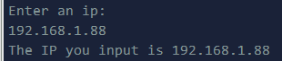

# 初始化配置
购买为知盒子后，需要进行服务的初始化，以保证客户端能够正常访问盒子。
在执行初始化之前，请按照说明书提示，连接电源和网线。

#### 使用应用程序进行初始化
1. 访问 ： http://release.wiz.cn/WizBoxClient-2015-05-12.exe   ，下载初始化应用程序，双击运行。
2. 程序将自动扫描为知盒子

   

3. 发现服务后，认证身份，修改访问IP，点击“确定”。

   

 * 配置管理员密码为：123456 （初始化完成后，可在管理后台中修改此密码）
 * IP地址必须为DHCP IP地址池外的IP地址，请咨询您的网络管理员，避免与局域网中的固定IP冲突

   > IP修改参考：若发现服务的IP地址最末尾数字为 2-100之间，推荐设置为200；若发现服务的IP地址最末尾数字为100以上，推荐设置为50）

4. 修改完成，点击按钮，可跳转至管理后台，进行添加用户等操作。或下载客户端，访问为知笔记。

  

5. 如需修改IP地址，再次运行程序，点击“重新配置”修改即可。

#### 手工初始化

若使用初始化程序无法自动发现服务，您还可以在服务器上连接显示器和键盘，按如下步骤操作：
1. 打开终端工具，显示如下界面：

   

2. 输入用户名 wiznote及默认密码，回车。登录成功后的界面如下图：

   

3. 输入命令：/wiz/EnterpriseDeploy/change-ip.sh，点击回车

4. 按照提示输入IP地址，完成后提示如下图：

    

4. 再次运行WizFinder检查是否能够显示正确的IP地址

