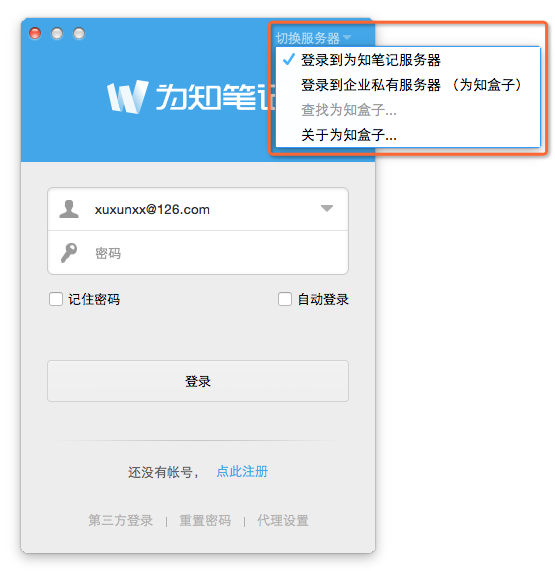

# 初始化配置
购买为知盒子后，需要进行服务的初始化，以保证客户端能够正常访问盒子。
在执行初始化之前，请按照说明书提示，连接电源和网线。

#### 使用应用程序进行初始化
1. 访问 ： http://blog.wiz.cn/wizbox-download.html   ，下载初始化应用程序，双击运行。
2. 程序将自动扫描为知盒子

   

3. 发现服务后，认证身份，修改访问IP，点击“确定”。

   

 * 配置管理员密码为：123456 （初始化完成后，可在管理后台中修改此密码）
 * IP地址必须为DHCP IP地址池外的IP地址，请咨询您的网络管理员，避免与局域网中的固定IP冲突

   > IP修改参考：若发现服务的IP地址最末尾数字为 2-100之间，推荐设置为200；若发现服务的IP地址最末尾数字为100以上，推荐设置为50）

4. 修改完成，点击按钮，可跳转至管理后台，进行添加用户等操作。或下载客户端，访问为知笔记。

  

5. 如需修改IP地址，再次运行程序，点击“重新配置”修改即可。

#### 手工初始化

若使用初始化程序无法自动发现服务，您还可以在服务器上连接显示器和键盘，按如下步骤操作：

1. 打开终端工具，显示如下界面：

   

2. 输入用户名 wiznote及默认密码，回车。登录成功后的界面如下图：

   

3. 输入命令：/wiz/EnterpriseDeploy/net-config.sh -i <ip> -n <netmask> -g <gateway>
例如，想要将为知盒子的 ip 地址改为：192.168.1.8，子网掩码为 255.255.255.0 ，网关为 192.168.1.1 （若盒子不连接外网，该项可为空），则命令为：/wiz/EnterpriseDeploy/net-config.sh -i 192.168.1.8 -n 255.255.255.0 -g 192.168.1.1
执行过程及成功结果如下图：

    

4. 再次运行WizFinder检查是否能够显示正确的IP地址

#### 使用客户端自动连接

为知笔记客户端支持自动连接为知盒子。IP 配置完成后，在为知笔记官方网站 [www.wiz.cn/download](http://www.wiz.cn/download) 上下载最新版客户端，可自动连接盒子。

客户端自动连接盒子操作示意图

1. Windows 版客户端
    
     

2. Mac 版客户端

        

3. iPhone 版客户端

        

4. Android 版客户端

     

    

 

