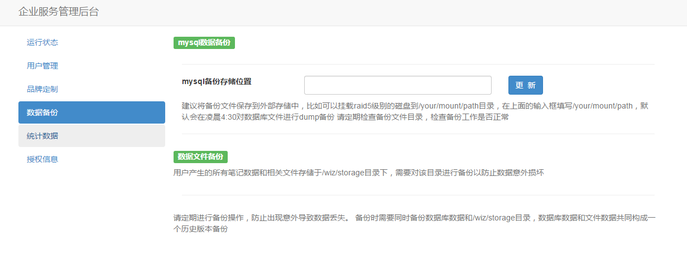

# 数据备份

为知盒子硬盘采用了RAID1技术,在不影响性能情况下最大限度的保证系统的可靠性和可修复性

 > RAID 1称为磁盘镜像，原理是把一个磁盘的数据镜像到另一个磁盘上，也就是说数据在写入一块磁盘的同时，会在另一块闲置的磁盘上生成镜像文件，只要系统中任何一对镜像盘中至少有一块磁盘可以使用，甚至可以在一半数量的硬盘出现问题时系统都可以正常运行,当一块硬盘失效时，系统会忽略该硬盘，转而使用剩余的镜像盘读写数据，具备很好的磁盘冗余能力。

### mysql 数据备份

在备份存储位置中填写/your/mount/path，默认会在凌晨4:30对数据库文件进行dump备份 请定期检查备份文件目录，检查备份工作是否正常

建议将备份文件保存到外部存储中，例如可挂载 RAID5 级别的磁盘到 /your/mount/path 目录

### 数据文件备份

用户产生的笔记、附件和相关文件，都存储于 /wiz/storage 目录下，可对该目录进行备份以防止数据意外损坏

### 注意

 * 请定期进行备份操作
 * 可在系统使用频率较低的凌晨执行备份
 * 备份时需要同时备份数据库数据和 /wiz/storage 目录，并将处于同一时间点的数据库数据和文件数据共同构成一个历史版本备份

