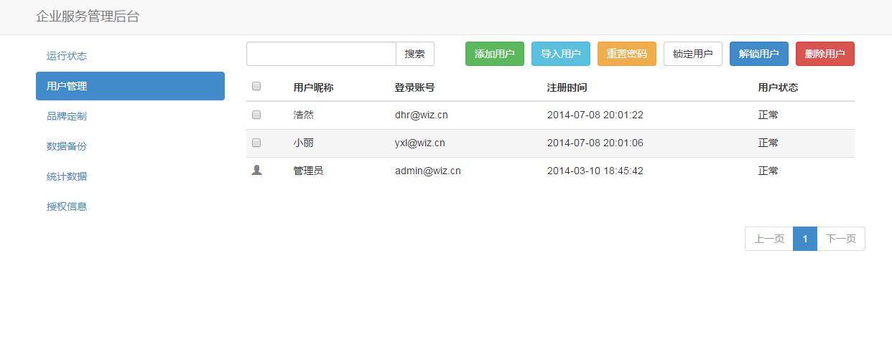
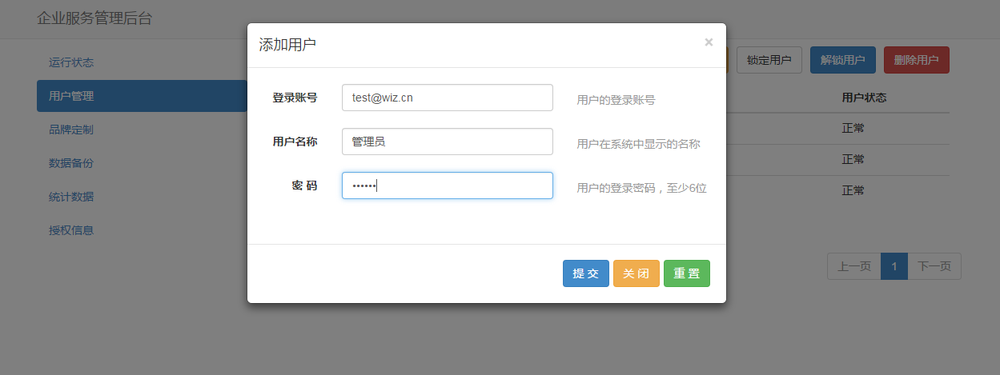
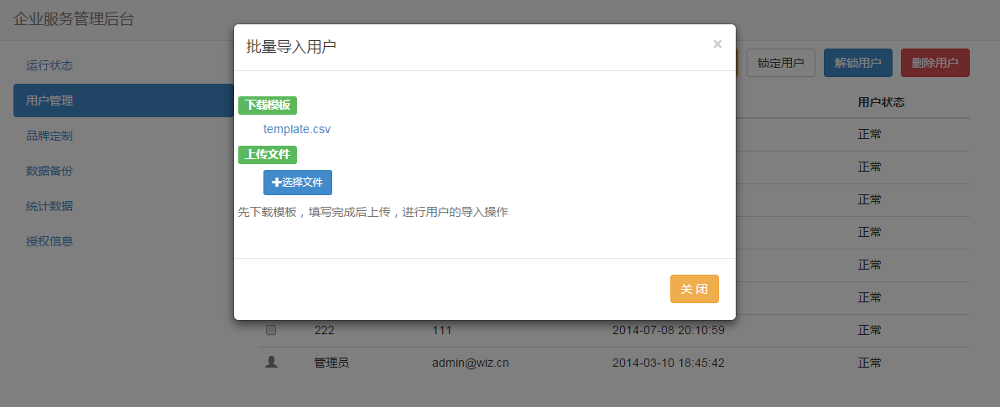

# 用户管理
管理员可在后台中统一添加用户。可单独创建，也可批量导入

 

### 添加用户

点击 “添加用户” 按钮，在弹出窗口中输入用户登录名、名称和密码

 

 * 用户名格式建议为邮箱格式
 * 名称将作为用户昵称

### 导入用户

点击 “导入用户” ，下载导入用户模板，按照模板填写之后，上传导入即可

 

### 重置密码

勾选用户，点击 “重置密码” ，可将用户密码重置为初始密码：123456

### 锁定用户

当有成员离职或其他情况不再使用公司的为知盒子，可将该用户锁定，使其无法再登录。
勾选用户，点击 “锁定用户” ，可将该用户锁定。

### 解锁用户

勾选被锁定的用户，点击 “解锁用户” ，可给账号解锁

### 删除用户

勾选需要删除的用户，点击 “删除用户” ，可将账号删除

 * 账号删除后，数据不受影响。但用户昵称将不显示。
